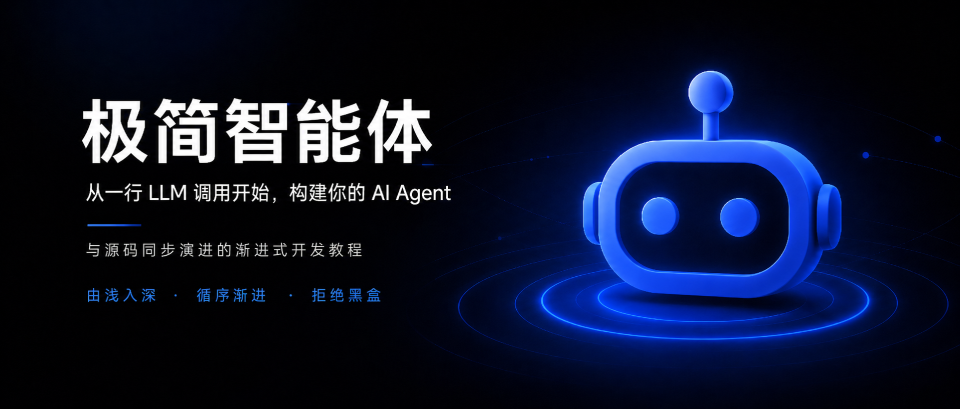
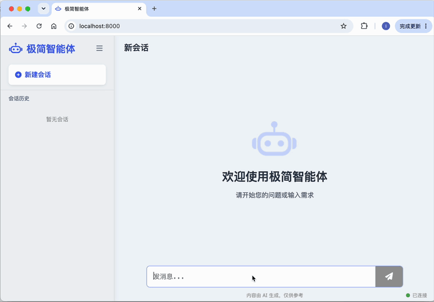

<div align="center">
<h1>极简智能体 (Tiny Agent)</h1>

<p>从一行 LLM 调用开始，手把手构建你的 AI Agent </p>

<a href="https://github.com/leonlucc/tiny-agent/stargazers"></a>
<a href="https://github.com/leonlucc/tiny-agent/blob/main/LICENSE"></a>
<a href="https://python.org"></a>

**简体中文** | [English](README_EN.md) 
<br>
</div>



Tiny Agent 是一个轻量级的 AI 智能体开源项目，也是一本与源码同步演进的渐进式开发教程。项目遵循**由浅入深、循序渐进**的设计理念，不依赖复杂框架，从一次最简单的大模型调用开始，逐步构建出一个具备感知、记忆、规划、行动能力的智能体。适合已掌握 Python 基础、想掌握AI Agent底层原理的开发者。


## 项目特点

* 🚀 **极简轻量化实现**：零重型框架依赖，剔除冗余封装，代码注释完整，单文件模块易阅读、逐行可拆解学习
* 🧩 **高内聚模块化分层**：LLM、向量库、工具调用、记忆模块完全解耦，支持自由替换、二次拓展改造
* 🔧 **单体架构**：单进程同时托管前后端，无需前端打包工具，一键启动，降低本地调试成本
* 🤖 **覆盖现代Agent核心链路**：从基础LLM对话到ReAct、长记忆、多智能体全流程落地
* 📚 **渐进式教学版本**：每个Git Tag独立可运行，跟随版本迭代分步实操，边写边理解原理

## 适合对象

* **想搞懂底层原理的开发者**：不满足于调用 LangChain 等黑盒框架，想从零手写 ReAct、RAG 和工具调用。
* **找实战范例的 Python 学习者**：懂 Python 基础，想通过一个无冗余代码、逐行可调试的项目学习 Agent。
* **想极速验证想法的工程师**：不需要复杂的 Vue/React 前端环境，单进程一键启动极简 Web 界面。

> ⚠️ **注意**：本项目侧重**教学与源码理解**。如需开箱即用的企业级生产框架，建议选择 LangChain 等其他框架。
---

## 技术栈

### 后端

* Python (3.12+) + FastAPI
* 选型说明：轻量化 web 服务，无重型 Agent 框架依赖


### 前端

* 原生 HTML + CSS + Vanilla JavaScript
* 选型说明：摒弃 Vue/React 等框架，降低前端学习门槛

---

## 快速开始

克隆仓库，安装依赖，配置参数，运行服务：
``` Bash
# 1. 拉取项目代码
git clone git@github.com:leonlucc/tiny-agent.git
cd tiny-agent

# 2. 进入后端目录，安装依赖
cd backend
pip install -r requirements.txt

# 3. 配置大模型密钥
cp .env.example .env
# 打开 .env 文件，填写大模型提供商LLM_API_KEY等参数

# 4. 启动 Web 服务
python -m app.main
```

启动后打开 `http://127.0.0.1:8000`，即可在浏览器中输入消息并查看 SSE 流式输出。


👉 请移步查阅：🔗 [完整快速开始指南](doc/quick-start.md)

---

## Roadmap

Tiny Agent 采用渐进式演进方式，每个版本引入一个新的核心能力。你可以通过Git Tag随时切换，跟随项目由浅入深地手写出完整的 Agent 体系。

| 版本 | 主题 | 核心能力 | UI 变化 |
|:---|:---|:---|:---|
| **v0.1** | Hello LLM | LLM SDK 配置与单轮问答 | 无 UI，纯 CLI |
| **v0.2** | Streaming Web | SSE 流式输出与 Web 前端实时渲染 | 极简 Web 页面，逐字打印 |
| **v0.3** | Multi-turn Chat | 消息历史管理与多轮连续对话 | 消息列表，保留历史 |
| **v0.4** | Structured Output | Prompt Template、JSON Schema 结构化输出 | 对话框支持 JSON 格式渲染 |
| **v0.5** | Basic RAG | 文档切分、Embedding 与本地向量存储，检索‑生成闭环 | 显示文档引用来源 |
| **v0.6** | Tool Calling | 工具声明、参数生成、执行与结果回填 | 展示 Tool 调用链路 |
| **v0.7** | Agent Loop | ReAct 循环、自主决策与终止控制 | 智能体模式，可视化执行轨迹 |

👉 请移步查阅：🔗 [完整 Roadmap 详解](book/src/roadmap.md)

---

## 设计理念

Tiny Agent 核心目标优先服务教学与原理学习，而非商用复杂业务落地：

* **解耦原理与工程**：用最少的代码实现最核心的 Agent 能力，最小化第三方依赖。开发者能直接阅读核心流程源码，无黑盒封装遮挡底层原理。
* **克制的 UI 迭代**：每个版本只增加支撑该能力所需的最少前端代码，不叠加多余页面组件。开发者可同步对照前后端改动，直观理解「后端新增能力如何映射到前端交互」。
* **渐进式版本演进**：每一个 Git Tag 都是完整可运行版本，不存在断层代码。开发者可按版本顺序逐步开发，也可单独切换某一版本针对性学习单一能力，搭建分层递进的学习路径。

## 许可证

- **源代码**（`frontend`、`backend` 目录下的文件）：采用 **Apache License 2.0** 开源。

- **教程文档**（`book`、`doc`目录下的文档 ）：保留所有权，采用 **CC BY-NC-ND 4.0** 许可，禁止商用及修改。
