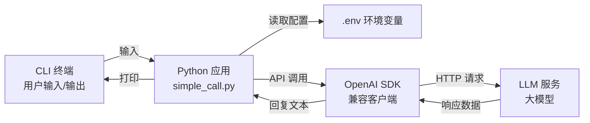

# 第一章：Hello LLM（你好，大模型）

> **导语**：本章是 Tiny Agent 的起点，不用前端、不做多轮历史，只先跑通“用户输入一句话，大模型回复一句话”的最小闭环。完成本章后，你将掌握大模型的 API 调用方式，为 Agent 开发奠定基础。
>
> **源码版本**：[v0.1](https://github.com/leonlucc/tiny-agent/tree/v0.1)

---

## 1. 让 Agent 第一次开口

在构建 Agent 之前，我们先让程序具备最基础的能力：把一段文本发送给大模型，并把模型返回的文本打印出来。

一个完整 Agent 以后会有工具、记忆、知识库、规划循环，但它们最终都会回到一个核心动作：**向 LLM 发起请求，并读取返回结果**。所以第一章刻意只保留 CLI 终端交互，让注意力集中在后端请求链路本身。

本章完成后的运行效果如下：

```bash
$ python -m app.main

==================================================
Tiny Agent - Hello LLM
==================================================
输入一条消息发送给大模型，输入 exit 退出。

你: 你好，请用一句话介绍你自己
AI: 你好，我是一个可以理解和生成文本的 AI 助手。

你: exit
再见！
```

---

## 2. 整体方案

本章采用“CLI 输入 → Python 函数 → OpenAI 兼容 SDK → LLM 服务 → CLI 输出”的最小方案，先跑通单轮文本输入与输出。

整体链路可以拆成四步：

1. 从 `.env` 读取模型服务配置。
2. 使用 `OpenAI` SDK 创建兼容 OpenAI 协议的客户端。
3. 把用户输入包装成一条 `user` 消息，调用 `client.chat.completions.create()`。
4. 从响应中取出 `response.choices[0].message.content` 并打印到终端。

这个版本没有 Web UI、没有多轮对话，它只做一件事：**验证代码能成功调用LLM并获取回复**。


---

## 3. 核心概念

本章只保留实现 Hello LLM 必需的概念。

### 3.1 OpenAI 兼容 SDK

OpenAI Python SDK 可以调用 OpenAI 官方接口，也可以调用兼容 OpenAI 协议的第三方大模型服务。

本章通过两个参数创建一个请求客户端：

```python
client = OpenAI(api_key=api_key, base_url=base_url)
```

- `api_key`：模型服务的访问密钥。
- `base_url`：模型服务的接口地址。

### 3.2 环境变量

环境变量用于把密钥、服务地址、模型名称从代码里移出去，避免把敏感信息写死在源码中。

本章使用三个配置项：
- `LLM_API_KEY`：访问模型服务需要的 API Key。
- `LLM_BASE_URL`：模型服务的 OpenAI 兼容接口地址。
- `LLM_MODEL`：本次调用使用的模型名称。

### 3.3 大模型消息

LLM 的 Chat 接口不是直接传入一段字符串，而是传入一个消息列表。设计成消息列表，是因为后续可以放入多条历史消息和系统提示词——这让多轮对话成为可能。

本章只需要一条用户消息：

```python
messages=[{"role": "user", "content": message}]
```

- `role="user"` 表示这条消息来自用户。
- `content` 是用户输入的文本内容。

后续章节会继续加入 `assistant` 历史消息和 `system` 提示词。本章先保持最小结构。

### 3.4 单轮调用

单轮调用表示每次请求只包含当前这一条用户输入，模型不会自动记住上一次对话。

核心调用如下：

```python
response = client.chat.completions.create(
    model=model,
    messages=[{"role": "user", "content": message}],
    timeout=30.0,
)
```

返回结果中，真正要打印的回复文本位于：

```python
response.choices[0].message.content
```

---

## 4. 工程实现

本章新增一个最小 Python 后端目录，让 `backend/app/main.py` 作为入口，实际逻辑放在 `backend/app/simple_call.py`。

### 4.1 目录结构

```text
backend/
├── .env.example
├── requirements.txt
└── app/
    ├── __init__.py
    ├── main.py
    └── simple_call.py
```

### 4.2 新增依赖

`backend/requirements.txt`：

```txt
openai>=1.0.0
python-dotenv>=1.0.0
```


### 4.3 环境变量管理

项目基于`.env` 文件管理环境变量参数，通过 `python-dotenv` 读取 `.env` 文件：

```python
from dotenv import load_dotenv

load_dotenv()
```
首次需要复制环境变量模板：

```bash
cp .env.example .env
```

然后根据自己的模型服务填写 `.env`，以DeepSeek为例：

```bash
LLM_API_KEY=your_api_key_here
LLM_BASE_URL=https://api.deepseek.com
LLM_MODEL=deepseek-v4-flash
```
> **💡 小贴士：安全提醒**
>
> `.env` 文件包含 API Key 等敏感信息，切记将其加入 .gitignore，避免意外提交到版本控制系统。

> **💡 小贴士：如何快速获取 API Key？**
>
> 本项目兼容标准的 OpenAI 协议，国内外的诸多主流平台都可以无缝接入。推荐注册并使用国内极速且高性价比的平台，例如 [DeepSeek](https://platform.deepseek.com/) 或 [硅基流动](https://siliconflow.cn/) 等 API 聚合服务。注册获取 `sk-...` 格式的密钥后，直接填入 .env 即可无缝运行。


### 4.4 运行入口

`backend/app/main.py` 只负责暴露运行入口：

```python
"""Tiny Agent 运行入口"""

from app.simple_call import main


if __name__ == "__main__":
    main()
```

这样用户可以在 `backend` 目录下运行：

```bash
.venv/bin/python -m app.main
```
注意：项目的运行工作目录是 `backend`，如果从其他目录运行会失败。

### 4.5 LLM 调用逻辑

`backend/app/simple_call.py` 承担本章的核心逻辑。

首先，启动时读取并检查环境变量：

```python
from openai import OpenAI

def create_client() -> tuple[OpenAI, str]:
    """从环境变量创建兼容 OpenAI 协议的 LLM 客户端，并返回模型名称。"""
    load_dotenv()

    # 提前检查环境变量是否配置完整
    api_key = os.getenv("LLM_API_KEY")
    base_url = os.getenv("LLM_BASE_URL")
    model = os.getenv("LLM_MODEL")

    if not api_key or api_key == "your_api_key_here":
        print("错误：未配置 LLM_API_KEY。", file=sys.stderr)
        print("请复制 .env.example 为 .env，并填写你的 API Key。", file=sys.stderr)
        raise SystemExit(1)

    if not base_url:
        print("错误：未配置 LLM_BASE_URL。", file=sys.stderr)
        print("请复制 .env.example 为 .env，并填写你的模型服务地址。", file=sys.stderr)
        raise SystemExit(1)

    if not model:
        print("错误：未配置 LLM_MODEL。", file=sys.stderr)
        print("请复制 .env.example 为 .env，并填写你的模型名称。", file=sys.stderr)
        raise SystemExit(1)

    # 构造 LLM 请求客户端
    return OpenAI(api_key=api_key, base_url=base_url), model
```

然后，封装一次单轮调用：

```python
def chat_once(client: OpenAI, model: str, message: str) -> str:
    """向大模型发送一条用户消息，并返回模型回复文本。"""
    response = client.chat.completions.create(
        model=model,
        messages=[{"role": "user", "content": message}],
        timeout=30.0,
    )

    content = response.choices[0].message.content
    return content or ""
```

最后，`main()` 负责终端交互：

```python
def main() -> None:
    """运行最小 CLI，实现单轮文本输入与输出。"""
    # 打印启动提示
    print("=" * 50)
    print("Tiny Agent - Hello LLM")
    print("=" * 50)
    print("输入一条消息发送给大模型，输入 exit 退出。")
    print()
    sys.stdout.flush()

    # 启动时先创建 LLM 请求客户端
    client, model = create_client()

    while True:
        try:
            # 读取用户输入，并去掉首尾空白字符。
            user_input = input("你: ").strip()
        except (EOFError, KeyboardInterrupt):
            print("\n再见！")
            return

        # 空输入不发送给模型，直接等待下一次输入。
        if not user_input:
            continue

        # 支持exit退出命令
        if user_input.lower() == "exit":
            print("再见！")
            return

        try:
            # 发起一次 LLM 调用，并将回复直接打印到终端。
            print("AI: ", end="", flush=True)
            print(chat_once(client, model, user_input))
            print()
        except Exception as exc:
            print(f"\n调用失败：{exc}\n", file=sys.stderr)
```

### 4.6 运行验证

进入 `backend` 目录：

```bash
.venv/bin/python -m app.main
```

如果没有配置 API Key，会看到：

```text
错误：未配置 LLM_API_KEY。
请复制 .env.example 为 .env，并填写你的 API Key。
```

配置正确后，输入任意文本即可得到模型回复；输入 `exit` 退出。

---

## 5. Git Diff 导读

本版本相对于空工程，核心变化是新增 `backend` 目录，上文已经详细讲解，完整代码已提交至 GitHub 仓库，你可以切换到 `v0.1` Tag查看或直接运行 `git checkout v0.1`查看。

---

## 6. 架构思考

本章代码很小，但它已经刻意做了几个取舍。

### 6.1 为什么先做 CLI，而不是 Web UI？

CLI 能把干扰降到最低：没有页面、没有接口路由、没有前端状态管理，只有一次真实的 LLM 网络请求。

这有助于建立一个重要直觉：**LLM 调用本质上是一次请求-响应过程**。后续无论接入 Web UI、工具调用还是 Agent Loop，底层都离不开这个动作。

### 6.2 为什么是 OpenAI SDK，而不是 LiteLLM 等聚合库？

在起步阶段，我们面临三种选择：大模型厂商原生 SDK、`LiteLLM` 等聚合库，以及 `LangChain` 等重型框架。我们最终选择最基础的 `OpenAI` SDK，基于以下考量：

* **事实上的行业标准**：如今几乎所有主流大模型服务商（如 DeepSeek、Qwen 等）都原生兼容 OpenAI 协议。只需开放 `base_url` 就能接入 90% 的模型，不需要引入任何第三方抽象层。
* **拒绝“中间商”**：`LiteLLM` 虽好，但它是一层“胶水”。它会屏蔽原始请求和响应的真实结构（如 `choices[0].message`），让读者失去对大模型原生协议的直觉。一旦报错，你也很难分清是底层接口还是适配层的 bug。

### 6.3 为什么只做单轮，不做聊天历史？

单轮调用更容易观察输入和输出的关系。

现在每次请求只包含当前用户输入：

```python
messages=[{"role": "user", "content": message}]
```

所以模型不会自动记住上一轮内容。下一章引入 Chat History 后，我们会把历史消息一起传给模型，让它具备连续对话的上下文。

### 6.4 为什么环境变量使用通用命名？

本章使用 `LLM_API_KEY`、`LLM_BASE_URL`、`LLM_MODEL`，而不是把变量名绑定到某个厂商。

这样做是为了保留替换空间：如果模型服务兼容 OpenAI 协议，通常只需要改 `.env`，不需要改调用代码。

### 6.5 为什么第一步就要引入 venv 虚拟环境？

有些初学者教程为了图省事，会让读者直接 `pip install` 到全局环境。我们从第一章的第一行代码起就强制要求使用 `venv`，原因很简单：

* **防止环境污染**：读者的电脑里可能跑着其他 Python 项目。直接在全局安装依赖极易引发库版本冲突，导致“新项目跑通了，老项目却挂了”的惨剧。通过虚拟环境隔离，并配合 `requirements.txt` 锁定版本，能彻底杜绝“在作者电脑上能跑，在读者电脑上报错”的诡异 bug。
* **零门槛与零依赖**：我们没有选择 `Conda` 或 `uv` 等更复杂的工具，是因为 `venv` 是 Python 3 标准库自带的官方工具。读者不需要额外安装任何软件，用最纯粹的方式解决最核心的隔离问题。

### 6.6 为什么通过 python-dotenv 管理环境变量？

在管理 API Key 等敏感信息时，传统的方法是在终端来导入系统环境变量。我们选择引入 `python-dotenv` 则是基于以下考量：

* **开发体验的确定性**：依赖操作系统的 `export` 具有很强的“临时性”。读者一旦关闭终端窗口、重启电脑，或者在 IDE内置的终端中运行，环境变量就会失效。`.env` 文件让配置紧贴项目目录，即开即用。
* **避免跨平台命令混乱**：不同操作系统的环境变量设置命令完全不同（Linux/macOS 用 `export`，Windows CMD 用 `set`，PowerShell 用 `$env:`），而 `.env` 文件是全平台通用的。

### 6.7 为什么错误处理非常简单？

本章的目标是跑通闭环，不是建立完整的错误分类体系。

因此代码只做两类处理：

- 启动时检查环境变量，缺配置就直接提示并退出。
- 调用时统一捕获异常，打印“调用失败”。

更细的网络错误、鉴权错误、限流错误、重试策略，会在后续版本更接近真实应用时再展开。

---

## 7. 本章小结

本章完成了 Tiny Agent 的第一个可运行版本：通过 CLI 读取用户输入，调用大模型，并把回复打印回终端。

你现在已经拥有了后续所有 Agent 能力的起点：

- 使用 `.env` 管理 `LLM_API_KEY`、`LLM_BASE_URL`、`LLM_MODEL`。
- 使用 `OpenAI` SDK 创建兼容 OpenAI 协议的客户端。
- 使用 `messages=[{"role": "user", "content": message}]` 发起单轮请求。
- 使用 `response.choices[0].message.content` 读取模型回复。
- 使用 `exit` 退出最小 CLI。

---

下一章，我们会在这个基础上引入流式 Web 输出，让 Tiny Agent 从一问一答的命令行，走向逐字呈现的浏览器。

[→ 进入第二章：Streaming Web（流式 Web 输出）](./chapter_02.md)
