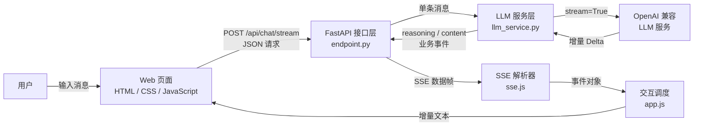

# 第二章：Streaming Web（流式 Web 输出）

> **导语**：上一章已经让 Tiny Agent 在终端中完成了一次 LLM 调用。本章把这条同步、整段返回的 CLI 链路升级为可在浏览器中实时预览的流式链路：后端一边接收模型输出，一边通过 SSE 转发；前端一边解析事件，一边更新页面。完成本章后，你将掌握构建 AI 流式应用全链路的核心能力，并理解 SSE 在实时交互中的正确使用方式。
>
> **源码版本**：[v0.2](https://github.com/leonlucc/tiny-agent/tree/v0.2)

---

## 1. 让等待变成可见的回答

在 CLI 版本中，程序必须等模型生成完全部内容，才能一次性打印回复。问题越复杂、回复越长，用户面对空白界面的时间就越久。即使总耗时没有变化，这种“提交后毫无反馈”的体验也很容易让人怀疑：请求到底发出去了吗？程序是不是卡住了？

常见的 AI 应用通常不会等完整答案生成后再展示，而是在收到第一批文本后立即呈现，后续内容持续追加。这样不能缩短模型真正的生成时间，却能显著缩短用户感知到的首字等待时间。

要做到这一点，仅仅增加一个网页还不够。整条链路都必须支持流式传递：

1. LLM 服务持续返回增量片段，而不是一次返回完整文本。
2. 后端服务收到片段后立刻向浏览器转发，不能先拼成完整答案。
3. 浏览器持续读取响应体，并将文本增量渲染到同一条消息中。
4. 请求失败或流结束时，前后端要恢复到明确、可继续操作的状态。

因此，本章的目标不是做一个功能完整的聊天产品，而是建立最小的实时 Web 闭环：**输入一条消息，模型回复随生成过程逐步出现在网页上**。

---

## 2. 整体方案

我们将采用前后端分离架构：FastAPI Web 后端服务和原生 HTML + CSS + JavaScript构成的前端页面。先不引入 Web 服务器，后端同时负责 API 路由与前端静态文件托管，Web 页面和接口来自同一个服务，以保持项目的开箱即用。

用户发送消息后，浏览器使用 `POST /api/chat/stream` 提交请求。后端把消息交给 LLM 服务层，并开启流式传输。模型每产生一段增量内容，服务层就把它转换为与厂商响应格式解耦的业务事件；接口层再把业务事件编码成 SSE 帧（Server-Sent Events，服务端推送事件）。浏览器持续读取响应流，解析出 `reasoning`、`content` 和 `error` 事件，最终增量更新页面。



一次请求的运行流程如下：

1. 页面把用户输入显示在聊天区，并锁定输入框，避免并发发送。
2. `APIClient` 使用 `fetch()` 发起 POST 请求，取得响应体的 `ReadableStream` 读取器。
3. 后端校验消息，调用异步 LLM 客户端并迭代模型返回的 chunk。
4. 服务层提取增量中的思考内容和正文内容，产生统一业务事件。
5. 接口层将每个事件编码为 `data: ...\n\n`，并立即写入响应。
6. 前端按 SSE 空行边界拆帧，将 JSON 事件交给应用层。
7. 应用层累积文本并更新同一个模型回复节点；收到 `[DONE]` 后恢复输入区。

这里最重要的设计思想是：**流不能在中途任何一层被重新聚合**。只要某一层等待完整结果后再返回，前面的流式能力就会失去意义。

---

## 3. 核心概念

本节介绍跑通本章链路必需的知识：LLM 增量输出、异步生成器、SSE 帧格式，以及浏览器端的流式解码。

### 3.1 完整响应与增量响应

上一章调用LLM时，SDK 返回的是已经生成完毕的完整响应：

```python
response = client.chat.completions.create(...)
content = response.choices[0].message.content
```

本章把调用改为异步流式模式：

```python
response = await client.chat.completions.create(
    model=model,
    messages=[{"role": "user", "content": message}],
    stream=True,
    timeout=30.0,
)

async for chunk in response:
    ...
```

`stream=True` 后，SDK 返回的不再是一条完整消息，而是一系列增量 chunk。文本通常位于 `choices[0].delta.content`。chunk 是网络和模型服务决定的传输片段，可能是一个字、一个词，也可能是一小段文本，不能假设“一次 chunk 就等于一个字符”。页面看起来像逐字打印，本质上是收到一批就更新一批。

某些推理模型还会通过非标准字段 `reasoning_content` 返回思考片段。项目把两类数据映射为不同业务事件：

```json
{"type": "reasoning", "chunk": "先分析问题……"}
{"type": "content", "chunk": "最终回答……"}
```

前端因此不必理解 `choices`、`delta` 或不同模型的字段结构，只需认识 Tiny Agent 自己的事件协议。

### 3.2 Python 异步生成器：边生产，边交付

流式接口的核心不是返回一个列表，而是逐次 `yield`。`stream_chat_events()` 的返回类型是 `AsyncIterator`：

```python
async def stream_chat_events(message: str) -> AsyncIterator[dict[str, str]]:
    ...
    async for chunk in response:
        ...
        yield {"type": "content", "chunk": content}
```

异步生成器同时解决了两个问题：

- 等待上游网络数据时，它会让出事件循环，不阻塞整个 Web 服务。
- 每次得到有效片段就交给下游，无需把完整回复保存在后端后再发送。

调用关系形成了一条自然的流式管道：LLM SDK 产出 chunk，服务层产出业务事件，接口层产出 SSE 字符串，FastAPI 将字符串写入 HTTP 响应。每层只负责一次转换，模块边界清晰。

### 3.3 SSE：建立单向事件流

Server-Sent Events（SSE）是一种基于 HTTP 的服务端到浏览器单向事件流。本章的交互方向正好符合它的特点：用户消息通过普通 POST 发向后端，模型生成结果沿同一个 HTTP 响应持续返回。

最小 SSE 事件由 `data:` 行和一个空行组成：

```text
data: {"type":"content","chunk":"你"}

data: {"type":"content","chunk":"好"}

data: [DONE]

```

其中：

- `Content-Type: text/event-stream` 告诉客户端这是 SSE 响应。
- 每个事件以空行结束，也就是字符串中的 `\n\n`。
- JSON 是项目选择的业务载荷格式，不是 SSE 强制规定的格式。
- `[DONE]` 是项目约定的结束标记，表示不再有业务事件。

后端还设置了三个与流式传输有关的响应头：

- `Cache-Control: no-cache`：避免缓存流式响应。
- `Connection: keep-alive`：保持连接以持续传输数据。
- `X-Accel-Buffering: no`：提示 Nginx 等代理不要攒满缓冲区后再统一转发。

如果代理层仍启用了压缩或响应缓冲，即使应用在不断 `yield`，浏览器也可能迟迟看不到数据。流式输出是端到端能力，部署链路中的每个环节都要允许数据及时通过。

### 3.4 使用 `fetch()` 读取流式响应

前端使用 `fetch()` 把用户输入作为 JSON 发送给流式接口：

```javascript
const response = await fetch('/api/chat/stream', {
    method: 'POST',
    headers: { 'Content-Type': 'application/json' },
    body: JSON.stringify({ message })
});

const reader = response.body.getReader();
```

与普通请求不同，流式响应不能直接调用 `response.json()`，因为此时完整响应尚未生成。代码通过 `response.body.getReader()` 取得读取器，随后反复调用 `reader.read()`，持续获得服务端已经发送的字节数据。

`fetch()` 在这里负责 HTTP 请求和响应流读取。字节解码、SSE 分帧和 JSON 解析则交给独立的 `readSSEStream()`，避免把请求逻辑与传输协议解析混在一起。

### 3.5 网络分块不等于 SSE 事件

`reader.read()` 返回的是一次网络读取结果，而不是一个完整 SSE 事件。一次读取可能只包含半个 JSON，也可能同时包含多个事件。如果直接对每次读取调用 `JSON.parse()`，程序会在真实网络环境中随机失败。

`readSSEStream()` 因此维护一个跨读取周期的 `buffer`：

1. 使用 `TextDecoder` 的流式模式把字节解码为 UTF-8 文本，避免多字节中文在分包处损坏。
2. 把新文本追加到 `buffer`。
3. 按 `\n\n` 或 `\r\n\r\n` 拆出所有完整事件。
4. 保留最后一个可能不完整的片段，等待下一批字节。
5. 提取事件中的 `data:` 行，遇到 `[DONE]` 结束迭代，否则解析 JSON 并向应用层 `yield`。

这层缓冲是流式前端能够稳定工作的关键。**传输层怎样分包，与应用层怎样分事件，是两件不同的事。**

---

## 4. 工程实现

本章把上一版集中在 `simple_call.py` 的 CLI 程序拆成配置层、LLM 服务层、API 层和前端展示层。

### 4.1 目录结构

```text
backend/
├── .env.example
├── requirements.txt
├── app/
│   ├── main.py
│   ├── config.py
│   ├── api/
│   │   └── endpoint.py
│   └── service/
│       └── llm_service.py

frontend/
├── index.html
├── css/
│   └── style.css
├── assets/
│   └── logo.png
└── js/
    ├── app.js
    ├── components/
    │   └── chat-ui.js
    └── services/
        ├── api.js
        └── sse.js
```

这个结构没有追求复杂框架，而是按照职责拆分：配置只负责读取配置，服务层只理解 LLM，接口层只理解 HTTP/SSE，前端服务模块只理解通信协议，UI 组件只负责 DOM。

### 4.2 增加 Web 运行依赖

`backend/requirements.txt` 在上一章依赖的基础上增加：

```text
fastapi>=0.115.0
uvicorn[standard]>=0.30.0
```

FastAPI 用于声明接口、校验请求并返回流式响应；Uvicorn 是实际监听端口、运行 ASGI 应用的服务器。LLM SDK 和 `.env` 配置方式保持不变。

### 4.3 `config.py`：集中配置与路径

上一章在 CLI 模块中直接调用 `load_dotenv()` 和 `os.getenv()`。进入 Web 结构后，配置成为多个模块的共同依赖，因此迁移到 `backend/app/config.py`。

该模块承担两项职责：

- 从明确的 `backend/.env` 路径加载模型配置，避免运行目录变化影响配置发现。
- 根据当前文件位置计算项目根目录和 `frontend` 目录，供静态文件托管使用。

`load_llm_config()` 继续校验 `LLM_API_KEY`、`LLM_BASE_URL` 和 `LLM_MODEL`。区别在于 Web 应用无法像 CLI 那样简单打印错误后继续循环，所以缺少配置时抛出 `RuntimeError`，让服务启动明确失败。

### 4.4 `main.py`：组装应用与管理生命周期

`backend/app/main.py` 从 CLI 入口变成 Web 应用的装配点。`create_app()` 完成两件事：

```python
app.include_router(router, prefix="/api")
app.mount("/", StaticFiles(directory=FRONTEND_DIR, html=True), name="frontend")
```

API 路由先注册在 `/api` 下，前端目录再挂载到根路径。访问 `http://127.0.0.1:8000/` 会得到 `index.html`，页面请求 `/api/chat/stream` 时仍由同一个 FastAPI 应用处理。

应用还使用 `lifespan` 管理 LLM 客户端：启动时调用 `init_client()`，关闭时调用 `close_client()`。客户端被整个进程复用，避免每条消息都重新创建连接池；服务退出时则主动释放网络资源。

最后，`main()` 使用 Uvicorn 在 `0.0.0.0:8000` 启动服务。

### 4.5 `llm_service.py`：隔离模型协议

`backend/app/service/llm_service.py` 是本章后端的业务核心。它持有一个进程级 `AsyncOpenAI` 客户端和当前模型名，并通过三个函数形成完整生命周期：

- `init_client()`：读取配置并创建客户端。
- `stream_chat_events(message)`：发起流式单轮调用并产生业务事件。
- `close_client()`：关闭客户端并清空引用。

服务层会跳过没有 `choices`、没有 `delta` 或没有有效文本的 chunk。对有效增量，它分别产生 `reasoning` 和 `content` 事件。这样，厂商 SDK 的对象结构被限制在服务层内部，接口层不会依赖 `choices[0].delta` 这些细节。

注意，传给模型的消息仍然只有当前用户输入：

```python
messages=[{"role": "user", "content": message}]
```

页面虽然能依次展示多条消息，但后端没有把旧消息再次发给模型。因此它目前只是多次独立的单轮问答，不是多轮对话。

### 4.6 `endpoint.py`：从业务事件到 SSE

`backend/app/api/endpoint.py` 提供两个接口：

- `GET /api/health`：返回 `{"status": "ok"}`，供页面显示连接状态。
- `POST /api/chat/stream`：接收 `{ "message": "..." }` 并返回 SSE 流。

`ChatRequest` 使用 Pydantic 描述最小请求结构。接口还会执行 `strip()`，空消息直接返回 HTTP 400，避免无意义的模型调用。

真正的协议转换发生在 `_stream_sse()`。它异步迭代服务层事件，通过 `json.dumps(..., ensure_ascii=False)` 保留可读的中文，再包装成 SSE 数据帧：

```python
yield f"data: {json.dumps(event, ensure_ascii=False)}\n\n"
```

流式响应有一个与普通 JSON 接口不同的错误处理特点：响应头一旦发出，后端通常不能再把状态码改成 500。因此，流开始后的异常会被记录到服务端日志，并转换为不泄露上游细节的 `error` 业务事件。无论成功还是失败，生成器最后都会发送一次 `[DONE]`，让前端拥有确定的结束语义。

### 4.7 `index.html` 与 `style.css`：最小聊天界面

前端没有引入构建工具或 UI 框架，只使用浏览器原生能力。`frontend/index.html` 提供：

- 用户输入框与发送按钮。
- 消息展示区与初始空状态。
- “正在思考”、用户消息、模型回复三个 `<template>`。
- 后端连接状态提示。

使用 `<template>` 可以把消息骨架留在 HTML 中，JavaScript 只需克隆节点并填充内容。`style.css` 负责聊天布局、消息样式、输入状态和移动端适配，不参与业务流程。

### 4.8 `api.js` 与 `sse.js`：分离 HTTP 和流协议

`frontend/js/services/api.js` 封装所有 HTTP 调用。`APIClient.chatStream()` 只负责发送消息、检查 HTTP 状态，并返回响应体读取器；`checkConnection()` 则访问健康检查接口。

`frontend/js/services/sse.js` 不关心请求从哪里来，只接收一个 reader，并通过异步生成器 `readSSEStream()` 持续产生解析后的业务事件。这种拆分让两个层次的错误含义保持清晰：

- HTTP 非 2xx、没有响应体，属于请求层错误。
- 事件帧损坏、JSON 无法解析，属于 SSE 协议错误。
- `{ "type": "error" }`，属于服务端在流内报告的业务错误。

### 4.9 `app.js` 与 `chat-ui.js`：调度和渲染

`frontend/js/app.js` 是页面的调度中心。`sendMessage()` 串起一次完整交互：

1. 展示用户消息，清空并锁定输入区。
2. 创建“正在思考”指示器和隐藏的模型回复节点。
3. 发起流式请求，使用 `for await...of` 消费 SSE 事件。
4. 分别累积 `reasoning` 和 `content`，再更新模型回复。
5. 正常结束时完成消息；空流或异常时展示错误。
6. 在 `finally` 中恢复输入区并重新聚焦。

`appState.isTyping` 保证同一时间只有一个流式请求。这个限制让本章不必处理多个响应交错、取消请求或消息归属等额外状态。

`frontend/js/components/chat-ui.js` 只负责局部交互与 DOM 更新。它通过 `createAssistantResponseView()` 返回 `update`、`complete`、`dispose` 三个操作，把一次模型回复看成一个 UI 生命周期。文本使用 `textContent` 写入，而不是直接拼接 `innerHTML`，既能保留纯文本语义，也避免把模型输出当作可执行 HTML 注入页面。

随着文本不断增长，聊天区需要持续滚动到底部。代码通过 `requestAnimationFrame` 合并高频滚动请求，避免每个小片段都立即触发布局计算。

### 4.10 启动与验证

安装新增依赖并配置环境变量：

```bash
cd backend
python -m venv .venv
.venv/bin/python -m pip install -r requirements.txt
cp .env.example .env
```

填写 `backend/.env` 后启动服务：

```bash
.venv/bin/python -m app.main
```

浏览器访问：

```text
http://127.0.0.1:8000
```

在输入框中发送一条消息。如果“正在思考”提示随后被模型回复替换，并且回复内容持续增长，说明从模型到浏览器的流式链路已经跑通。

> **系统页面截图（待补充）**
>
> 此处预留 v0.2 Streaming Web 运行效果截图，截图应包含输入框、已发送的用户消息，以及正在流式生成的模型回复。

---

## 5. Git Diff 导读

从上一章的基线来看，本章的能力变化可以归纳为四组：

| 变化位置 | 核心变化 | 解决的问题 |
| --- | --- | --- |
| `backend/app/main.py`、`config.py` | CLI 入口改为 FastAPI 应用；集中配置；托管前端 | 让 LLM 能力通过浏览器访问 |
| `backend/app/service/llm_service.py` | 同步完整调用改为 `AsyncOpenAI` 流式调用；映射业务事件 | 得到可逐段转发的模型增量 |
| `backend/app/api/endpoint.py` | 新增健康检查、POST 流式接口和 SSE 编码 | 建立浏览器与模型之间的实时 HTTP 通道 |
| `frontend/` | 新增页面、API 客户端、SSE 解析器和 UI 组件 | 解析并实时呈现流式回复 |
| `backend/requirements.txt` | 新增 FastAPI 与 Uvicorn | 提供 ASGI Web 服务运行环境 |

最值得优先阅读的差异不是 CSS，而是下面这条数据变换路径：

```text
response.choices[0].message.content
                ↓
AsyncOpenAI chunks
                ↓
{ type, chunk } 业务事件
                ↓
data: JSON\n\n
                ↓
浏览器增量更新 DOM
```

建议按以下顺序阅读代码：

1. 从 `llm_service.py` 看 `stream=True` 和 delta 如何变成业务事件。
2. 到 `endpoint.py` 看业务事件如何被包装成 SSE。
3. 到 `sse.js` 看字节流如何恢复为完整事件。
4. 最后看 `app.js` 和 `chat-ui.js` 如何把事件变成界面状态。

修复版本标签后，可以直接使用标准命令查看完整变更：

```bash
git diff --stat v0.1..v0.2
```

当前结果为：

```text
21 files changed, 1202 insertions(+), 99 deletions(-)
```

其中既包含 README、快速开始文档等配套更新，也包含本章的核心代码。若只关注运行实现，可以缩小比较范围：

```bash
git diff --stat v0.1..v0.2 -- backend/app backend/requirements.txt frontend
```


---

## 6. 架构思考

### 6.1 为什么选择 SSE，而不是 WebSocket？

本章只有一个实时方向：浏览器提交一次问题，服务端持续返回回答。SSE 建立在普通 HTTP 之上，能直接配合 FastAPI 的 `StreamingResponse`、浏览器 `fetch()` 和现有代理基础设施，也便于使用常规 HTTP 工具观察数据。

WebSocket 更适合双方都要随时主动推送的长连接场景，例如语音对话、协同编辑或服务端主动通知。它当然也能完成本章任务，但会额外引入连接生命周期、消息路由和心跳等概念，不符合本章的最小目标。

### 6.2 为什么前端使用 `fetch()`，而不是 `EventSource`？

浏览器原生的 `EventSource` 能自动连接和解析 SSE，但它主要面向 GET 订阅，不能直接发送带 JSON 请求体的 POST 请求。本章需要把用户输入提交给 `/api/chat/stream`，因此使用 `fetch()` 发起 POST，并从 `response.body` 手动读取事件流。

另一种设计是先用 POST 创建任务，再让 `EventSource` 通过 GET 订阅任务结果。这种方式能利用自动重连等原生能力，却需要引入任务 ID、任务状态和额外接口。对 v0.2 的单次问答而言，`fetch()` 让一次请求同时承载输入和流式输出，链路更短。

### 6.3 为什么定义业务事件，而不原样转发 SDK chunk？

直接把模型 SDK 的响应对象转给前端，代码看起来更少，却会让页面依赖某个厂商的字段结构。只要更换模型、SDK 升级或增加新的输出类型，前端就可能跟着修改。

`reasoning`、`content`、`error` 是 Tiny Agent 自己的最小事件协议。服务层负责吸收模型差异，接口层和前端只依赖稳定事件。这是一个很小但重要的抽象层：外部协议变化不会直接扩散到整个应用。

### 6.4 为什么服务层不直接生成 SSE 字符串？

SSE 是传输协议，LLM delta 是业务输入。如果 `llm_service.py` 直接产生 `data: ...\n\n`，模型逻辑就会与 Web 协议绑定，未来想把同一能力提供给 CLI、WebSocket 或后台任务时很难复用。

当前分层让服务层输出普通字典，接口层再决定如何传输。未来切换传输方式时，模型事件映射逻辑也可以保持不变。

### 6.5 为什么前端要累积文本，而不是只追加当前 chunk？

当前 UI 每次收到事件后，将 chunk 累积到 `streamedContent` 或 `streamedReasoning`，再把完整累计文本写入对应节点。这种实现直观，而且容易保证界面内容与应用状态一致。

它的代价是回答很长时会重复写入越来越大的字符串。更高吞吐的实现可以只追加文本节点，或按动画帧批量刷新。但在最小教学版本中，清晰的数据流比过早优化更重要；项目已经先用 `requestAnimationFrame` 节流高频滚动这一明显热点。

### 6.6 当前版本还缺少什么？

本章有意保留以下边界：

- 没有聊天历史，模型仍是单轮问答。
- 没有取消生成，用户只能等待当前流结束或失败。
- 同一页面只允许一个进行中的请求，没有并发流调度。
- 没有 Markdown 渲染，模型输出按安全纯文本展示。
- 没有重试、限流、鉴权和请求级可观测性。
- 客户端断开后，尚未显式把取消信号传递给上游模型请求。

这些都是真实产品会继续解决的问题，但它们不是建立最小流式 Web 链路的必要条件。把它们留到需求出现时再加入，能保持每个版本的学习主题单一。

### 6.7 页面显示多条消息，为什么仍不算多轮对话？

“界面保留了旧消息”和“模型拥有对话上下文”是两个不同概念。当前 `stream_chat_events()` 每次仍然只发送：

```python
[{"role": "user", "content": message}]
```

之前的用户问题和助理回答只存在于 DOM 中，没有进入下一次 LLM 请求。要支持真正的连续追问，需要定义聊天历史数据结构、维护消息顺序，并在每次调用时把必要上下文一同发送给模型。这正是下一版本要解决的问题。

---

## 7. 本章小结

本章让 Tiny Agent 从终端中的整段回复，演进为浏览器中的实时流式输出：

- 使用 FastAPI 和 Uvicorn 建立最小 Web 服务，并托管原生前端页面。
- 使用 `AsyncOpenAI`、`stream=True` 和异步生成器逐段接收模型输出。
- 用稳定的 `reasoning`、`content`、`error` 业务事件隔离模型协议。
- 使用 SSE 将业务事件持续传给浏览器，并用 `[DONE]` 明确结束。
- 使用 `fetch()`、`ReadableStream`、`TextDecoder` 和跨分包缓冲可靠解析事件。
- 将 HTTP、SSE、应用调度和 DOM 渲染拆成职责清晰的前端模块。

现在，Tiny Agent 已经具备一个 AI 应用最基础的全栈实时交互外壳。但它只是把每次独立回答展示在同一个页面上，模型仍然不知道“刚才聊过什么”。

下一章，我们将在这条流式链路上加入 Chat History，让 Tiny Agent 从多次独立问答走向真正的多轮对话。

[→ 进入第三章 Multi-turn Chat（多轮对话）](./chapter03.md)
