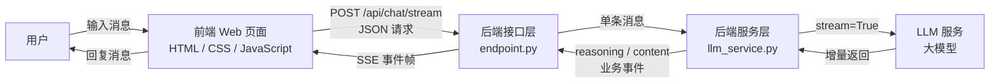
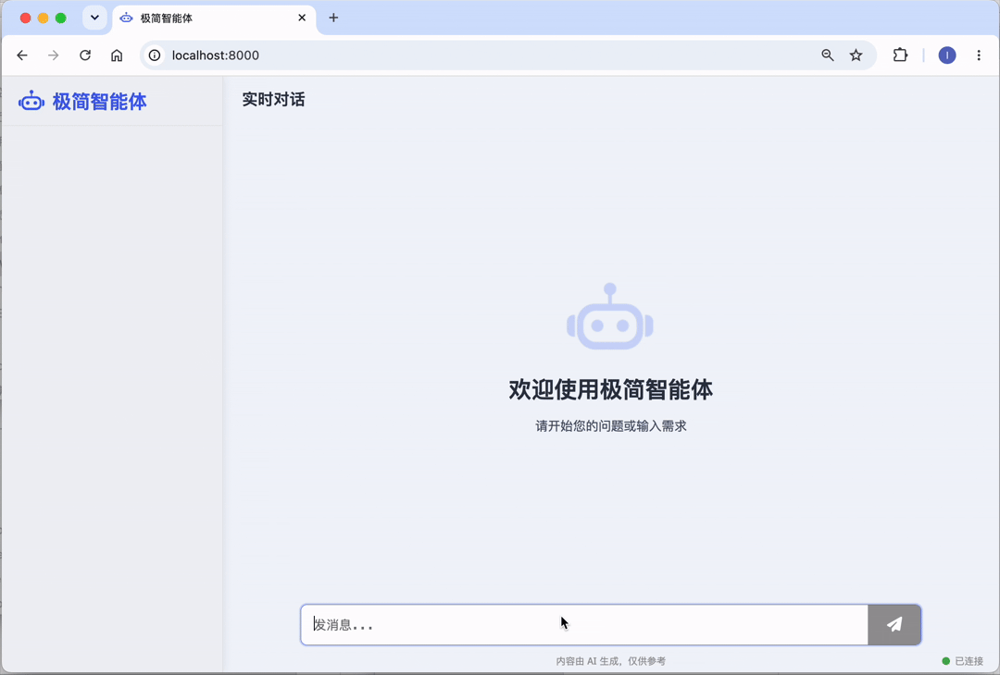

# 第二章：Web 流式输出

> **导语**：上一章已实现在终端中完成一次 LLM 调用。本章将其升级为浏览器实时流式预览：后端接收并转发模型输出，前端同步解析更新。完成本章后，你将掌握 AI 流式应用全链路构建能力与 SSE 的正确用法。
>
> **源码版本**：[v0.2](https://github.com/leonlucc/tiny-agent/tree/v0.2)

---

## 1. 让回答流动起来

在上一版本中，程序必须等模型生成完全部内容，才能一次性打印回复。问题越复杂、回复越长，用户面对空白界面的时间就越久。即使总耗时没有变化，这种“提交后毫无反馈”的体验也很容易让人怀疑：请求到底发出去了吗？程序是不是卡住了？

常见的 AI 应用通常不会等完整答案生成后再展示，而是在收到第一批文本后立即呈现，后续内容持续追加。这样不能缩短模型真正的生成时间，却能显著缩短用户感知到的首字等待时间。

要做到这一点，仅仅增加一个网页还不够。整条链路都必须支持流式传递：

1. LLM 服务持续返回增量块，而不是一次返回完整文本。
2. 后端服务收到片段后立刻向浏览器转发，不能先拼成完整答案。
3. 浏览器持续读取响应体，并将文本增量渲染到同一条消息中。

因此，本章的目标是建立最小的实时 Web 闭环：**输入一条消息，模型回复随生成过程逐步出现在网页上**。

---

## 2. 整体方案

我们将采用前后端分离架构：FastAPI Web 后端服务和原生 HTML + CSS + JavaScript 构成的前端页面。为保持项目开箱即用，暂不拆分静态资源服务器，而是由同一个 FastAPI 应用同时提供 API 和前端页面。

用户发送消息后，浏览器提交 POST 请求。后端把消息交给 LLM 服务，并开启流式传输。模型每产生一段增量内容，后端服务层就把它转换为与 LLM 服务响应格式解耦的业务事件；后端接口层再把业务事件编码成 SSE 帧（Server-Sent Events，服务端推送事件）。浏览器持续读取响应流，解析出事件内容，最终增量更新页面。


```mermaid
flowchart LR
    User["用户"] -->|输入消息| UI["前端 Web 页面<br/>HTML / CSS / JavaScript"]
    UI -->|"POST /api/chat/stream<br/>JSON 请求"| API["后端接口层<br/>endpoint.py"]
    API -->|单条消息| Service["后端服务层<br/>llm_service.py"]
    Service -->|"stream=True"| LLM["LLM 服务<br/>大模型"]
    LLM -->|增量返回 | Service
    Service -->|"reasoning / content<br/>业务事件"| API
    API -->|"SSE 事件帧"| UI
    UI -->|"回复消息"| User
```

```mermaid
flowchart TB

```
一次请求的运行流程如下：

1. 页面把用户输入显示在聊天区，并锁定输入框，避免并发发送。
2. 前端使用 `fetch()` 函数发起 `POST /api/chat/stream` 请求，取得 SSE 响应体的读取器。
3. 后端校验消息，调用异步 LLM 客户端并迭代模型返回的 chunk。
4. 后端服务层提取增量中的思考内容和正文内容，产生统一业务事件。
5. 后端接口层将每个事件编码为 `data: ...\n\n`，并立即写入响应。
6. 前端按 SSE 空行边界拆帧，识别后端的业务事件。
7. 前端累积文本并更新同一个模型回复消息的页面；收到 `[DONE]` 后恢复输入区。

这里最重要的设计思想是：**链路中的每个环节都要允许流式数据及时通过**。只要某一层等待完整结果后再返回，前面的流式能力就会失去意义。

---

## 3. 核心概念

本节介绍跑通本章链路必需的知识：LLM 增量输出、异步生成器、SSE 帧格式，以及浏览器端的流式解码。

### 3.1 完整响应与增量响应

上一章使用同步客户端 `OpenAI` 调用 LLM。调用期间，当前线程会一直等待，直到 SDK 返回已经生成完毕的完整响应：

```python
from openai import OpenAI

client = OpenAI(...)
response = client.chat.completions.create(...)
content = response.choices[0].message.content
```

Web 服务需要在等待模型数据时继续处理其他任务，因此本章改用 `AsyncOpenAI`。它和上一章的 `OpenAI` 属于同一个 SDK，但调用方式不同：

```python
from openai import AsyncOpenAI

client = AsyncOpenAI(api_key=api_key, base_url=base_url)
response = await client.chat.completions.create(
    model=model,
    messages=[{"role": "user", "content": message}],
    stream=True,
    timeout=30.0,
)

async for chunk in response:
    ...

await client.close()
```

这里有两个变化：

- `OpenAI` 变为 `AsyncOpenAI`：同步等待变为异步等待，适合并发处理请求的 Web 服务。
- `stream=False`（默认值）变为 `stream=True`：完整响应变为一系列增量 chunk。

异步并不自动等于流式；即使使用 `AsyncOpenAI`，如果没有设置 `stream=True`，仍然会等待完整响应。反过来，同步客户端也可以请求流式响应，但迭代上游数据时会同步阻塞当前执行线程。本章把两者结合，构成异步流式调用。

设置 `stream=True` 后，增量响应的返回位于 `choices[0].delta.content`，而不再是完整响应中的 `choices[0].message.content`。我们用 chunk 来表示模型服务返回的传输片段，可能是一个字、一个词，也可能是一小段文本。页面看起来像逐字打印，本质上是收到一批就更新一批。

部分大模型还会通过扩展字段`choices[0].delta.reasoning_content`返回可展示的思考内容或推理摘要。该字段并非通用标准，是否存在以及具体语义取决于模型服务，并不等同于模型完整的内部思考内容。

我们会把两类数据映射为不同业务事件：
```json
{"type": "reasoning", "chunk": "先分析问题……"}
{"type": "content", "chunk": "最终回答……"}
```

前端因此不必理解 `choices`、`delta` 或不同模型的字段结构，只需认识 Tiny Agent 自己的事件协议。

> **💡 小贴士：为什么要区分“思考内容”和“回答内容”？**
>
> 部分大模型（通常被称为推理模型）在给出最终答案前，会先在内部进行一系列分析、推导，这段过程在流式响应里会通过 reasoning_content 字段逐块返回。可以把它想象成一位老师在纸上打草稿——他一边演算，我们一边就能看到他的思考步骤。而普通模型则像一位经验丰富的助手，省略了“展演”过程，直接给出答案，所以它们的流式 chunk 里只有 content，没有 reasoning_content。

### 3.2 Python 异步生成器：边生产，边交付

如果要实现一个后端的流式接口，其核心是不一次性返回结果，而是逐次 `yield`。例如，下面的`stream_chat_events()` 使用`async def`和`yield`定义了一个异步生成器。调用方可以在上游数据到达后逐批迭代，而不必等待完整结果。

```python
async def stream_chat_events():
    ... # 分批获取并处理 chunk
    yield {"type": "content", "chunk": chunk}
```

异步生成器同时解决了两个问题：

- 异步化：等待上游网络数据时，它会让出事件循环，不阻塞整个 Web 服务。
- 生成器：每次得到有效片段就交给下游，无需把完整回复保存在后端后再发送。

> **💡 小贴士：如何理解 `yield` 和 `async/await`**
>
> 在 Python 和 JavaScript 中，`yield` 就像一个可暂停的 `return`：交出值后函数会记住当前位置，下次取值时从暂停处继续执行，因此带 `yield` 的函数就是生成器，天生适合“边产生、边消费”的数据序列。`yield` 本身不创建并发，只负责把数据分批交出；真正的异步能力来自 `async/await`——它让函数在等待 I/O 等操作时挂起并释放控制权，不阻塞其他任务。将 `yield` 与 `async def`结合，就可以定义异步生成器。异步生成器实现了异步迭代协议，可以在 Python 中通过 async for 逐项消费。

### 3.3 SSE：建立单向事件流

SSE（Server-Sent Events）是一种基于 HTTP 的服务端到浏览器单向推送机制。本章中，用户消息通过普通 POST 请求发送给后端，模型输出则通过该请求的响应体持续返回。

#### 响应类型：`Content-Type`

服务端首先要通过 HTTP 响应头声明内容类型：

```http
Content-Type: text/event-stream
Cache-Control: no-cache
Connection: keep-alive
X-Accel-Buffering: no
```

其中，`Content-Type: text/event-stream` 告诉浏览器：响应体不是一次性 JSON 数据，而是一个持续到达的 SSE 事件流。其余三个响应头服务于流式传输：

- `Cache-Control: no-cache`：避免缓存流式响应。
- `Connection: keep-alive`：保持连接以持续传输数据。
- `X-Accel-Buffering: no`：提示 Nginx 等中间代理不要攒满缓冲区后再统一转发。

流式输出是端到端能力，如果有中间环节启用了压缩或响应缓冲，即使应用在不断 `yield`，浏览器也可能迟迟看不到数据。

#### 消息内容：SSE 事件帧

响应头只声明如何解释后续数据，真正的消息位于 HTTP 响应体中。最小 SSE 事件由 `data:` 行和一个空行组成，例如：

```text
data: {"type":"content","chunk":"你"}

data: {"type":"content","chunk":"好"}

data: [DONE]
```

* `data:` 是 SSE 定义的字段名，每个事件以空行结束，统一使用字符串中的 `\n\n`。
* `{"type":"...","chunk":"..."}` JSON 数据， 是本项目选择的业务载荷格式，并非 SSE 强制规定的格式。
* `[DONE]` 也不是 SSE 标准，而是项目约定的结束标记。

在 FastAPI 中，通过 `StreamingResponse` 定义 SSE 响应返回，一个完整的 SSE 接口示例如下：

```python
@app.get("/sse")
async def sse():
    async def stream():
        for chunk in ["你", "好"]:
            yield f"data: {json.dumps({'type': 'content', 'chunk': chunk}, ensure_ascii=False)}\n\n"
        yield "data: [DONE]\n\n"
    return StreamingResponse(
        stream(),
        media_type="text/event-stream",
        headers={
            "Cache-Control": "no-cache",
            "Connection": "keep-alive",
            "X-Accel-Buffering": "no",
        }
    )
```


### 3.4 使用 `fetch()` 读取流式响应

#### 认识 fetch()
`fetch()` 是浏览器提供的内置函数，用来向服务端发送网络请求并获取响应。它支持`GET`、`POST` 等多种请求方式。一个最简单的 `fetch` 请求如下：
```javascript
let response = await fetch('/api/hello');
let data = await response.json();
```
`response.json()` 会把服务端返回的完整数据直接解析成一个 JavaScript 对象。

#### 流式响应的不同之处
本章我们要处理的聊天接口是“流式”的：SSE 接口的返回不会一次性生成好再发送，而是生成一段就发送一段。因此服务端给我们的响应体并不是一个完整的整体，而是一个**连续的数据流**，数据会一块一块地到达。

如果我们仍然调用 `response.json()`，它会尝试等待所有数据接收完毕再解析，但在流式场景下这行不通，因为我们可能还没等到完整数据，或者想尽早开始处理已经收到的部分。所以，我们需要另一种读取方式：**逐步读取**。

#### 发送请求并获取读取器
前端依然使用 `fetch()` 发出请求，把用户输入作为 JSON 发送给流式接口：
```javascript
const response = await fetch('/api/chat/stream', {
    method: 'POST',
    headers: { 'Content-Type': 'application/json' },
    body: JSON.stringify({ message })
});
```
这一步和普通 POST 请求一样，指定了请求方法、请求头以及要发送的 JSON 数据。

接下来，我们不调用 `response.json()`，而是通过 `response.body.getReader()` 得到一个**读取器**：
```javascript
const reader = response.body.getReader();
```
`response.body` 是一个 `ReadableStream` 对象，代表着可以逐步读取的数据流。`getReader()` 方法返回一个与该流绑定的读取器，通过它可以一次读取一小块数据，而不是等待全部传输完成。

#### 循环读取数据块
有了 `reader` 之后，就可以反复调用 `reader.read()`，每次调用会返回一个包含两个属性的对象：
- `done`：布尔值，表示数据是否已经全部读完（`true` 表示流已关闭，没有更多数据了）。
- `value`：一个 `Uint8Array` 类型化数组，存放本次读取到的原始字节数据。

我们通常在一个循环中使用它，直到 `done` 为 `true`：
```javascript
while (true) {
    const { done, value } = await reader.read();
    if (done) break;

    // 在这里处理 value，即收到的一小段字节数据
}
```
因为数据是按字节传输的，如果我们要显示文本，还需要把字节转换成字符串（例如使用 `TextDecoder`）。下一节会详细介绍如何处理和显示这些逐步收到的文本片段。

通过这种方式，我们就能一边接收数据一边更新界面，让用户看到 AI 的回答“逐字”出现，从而获得更快的响应反馈。
### 3.5 网络分块不等于 SSE 事件

`reader.read()` 返回的是底层网络读取到的字节块，而不是应用层的 SSE 事件。一次读取可能只有半个事件，也可能包含多个事件。如果对每次读取的数据直接调用 `JSON.parse()`，程序只会在理想条件下偶然成功，一旦数据被任意切分，就会因为 JSON 不完整而抛出错误。

因此，需要维护一个跨读取周期的缓冲区 `buffer`，流程如下：
1. 使用 JavaScript 原生文本解码器类型`TextDecoder`，将收到的字节解码为 UTF-8 文本。连续解码时应采用流式模式 `decode(value, { stream: true })`，避免一个中文字符的多个字节被拆到不同网络块时发生乱码。
2. 将新解码的文本追加到 `buffer` 尾部。
3. 按 `\n\n` 分隔符将缓冲区拆分为多个事件片段，取出所有已完整到达的事件。
4. 拆分后，将末尾可能不完整的片段保留在 `buffer` 中，等待下一批字节到来后继续拼接。
5. 对每个完整事件，提取其中的 `data:` 行；如果内容为 `[DONE]` 则结束迭代，否则解析 JSON 并通过 `yield` 将结果传递给上层。

这层缓冲是流式前端能够稳定工作的关键。**传输层怎样分包，与应用层怎样分事件，是两件不同的事。**

---

## 4. 工程实现

本章把上一版集中在 `simple_call.py` 的 CLI 程序按照前后端拆分为不同模块，为后续功能扩展和维护提供更好的基础。
### 4.1 目录结构

```text
backend/
├── .env.example              # 环境变量配置示例
├── requirements.txt          # Python 依赖列表
├── app/
│   ├── main.py               # FastAPI 应用入口
│   ├── config.py             # 配置加载与统一管理
│   ├── api/
│   │   └── endpoint.py       # HTTP/SSE 接口定义
│   └── service/
│       └── llm_service.py    # LLM 调用与业务封装

frontend/
├── index.html                # 页面入口
├── css/
│   └── style.css             # 页面样式
├── assets/
│   └── logo.png              # 静态资源
└── js/
    ├── app.js                # 前端调度入口
    ├── components/
    │   └── chat-ui.js        # 聊天界面组件
    └── services/
        ├── api.js            # HTTP 请求封装
        └── sse.js            # SSE 流式通信封装
```

整体目录并未刻意采用复杂的工程化框架，而是遵循单一职责（Single Responsibility）的设计思想，根据功能边界进行拆分：

- **后端配置层（config）**：负责统一读取和管理运行配置，不参与业务逻辑。
- **后端服务层（services）**：负责封装与 LLM 的交互过程，包括请求组织、响应处理等核心业务逻辑，不关心网络通信方式。
- **后端接口层（api）**：负责提供 HTTP 与 SSE 接口，对外暴露统一访问入口，实现请求接收、参数校验以及结果返回。
- **前端服务层（services）**：负责封装 HTTP 请求和 SSE 流式通信，对上层屏蔽通信协议细节。
- **前端组件层（components）**：负责页面渲染与 DOM（Document Object Model，文档对象模型）操作，实现聊天窗口、消息展示等界面逻辑，不直接处理网络请求。
### 4.2 增加 Web 运行依赖

`backend/requirements.txt` 在上一章依赖的基础上增加：

```text
fastapi>=0.115.0
uvicorn[standard]>=0.30.0
```

FastAPI 用于声明接口、校验请求并返回流式响应；Uvicorn 是实际监听端口、运行 ASGI 应用的服务器，两者搭配使用。

### 4.3 `config.py`：集中配置与路径

上一章在 CLI 模块中直接调用 `load_dotenv()` 和 `os.getenv()`来加载环境变量。进入 Web 结构后，配置成为多个模块的共同依赖，因此迁移到 `backend/app/config.py`。

该模块同时承担两项职责：

- 从明确的 `backend/.env` 路径加载模型配置，避免运行目录变化影响配置发现。
- 根据当前文件位置计算项目根目录和 `frontend` 目录，供静态文件托管使用。
### 4.4 `main.py`：组装应用与管理生命周期

`backend/app/main.py` 从 CLI 入口变成 Web 应用的装配点。通过注册 API、挂载静态页面、定义生命周期函数，构建一个 FastAPI 应用：

```python
from collections.abc import AsyncIterator

import uvicorn
from fastapi import FastAPI
from fastapi.staticfiles import StaticFiles

from app.api.endpoint import router
from app.config import FRONTEND_DIR
from app.services.llm_service import close_client, init_client


async def lifespan(app: FastAPI) -> AsyncIterator[None]:
    """管理应用生命周期，启动时初始化 LLM 客户端，关闭时清理资源。"""
    await init_client()
    try:
        yield
    finally:
        await close_client()


def create_app() -> FastAPI:
    """创建 FastAPI 应用，注册接口路由并托管前端静态页面。"""
    app = FastAPI(title="Tiny Agent", lifespan=lifespan)
    app.include_router(router, prefix="/api")
    app.mount(
        "/",
        StaticFiles(directory=FRONTEND_DIR, html=True),
        name="frontend",
    )
    return app
```

`create_app` 定义 FastAPI 主体对象，API 路由先注册在 `/api` 下，前端目录再挂载到根路径。访问 `http://127.0.0.1:8000/` 会得到 `index.html`，页面请求 `/api/chat/stream` 时仍由同一个 FastAPI 应用处理。

`lifespan` 中 `yield` 之前的代码在应用启动时执行，之后的代码在应用关闭时执行。因此，启动时调用 `init_client()`，关闭时调用 `close_client()`。客户端被整个进程复用，避免每条消息都重新创建连接池；服务退出时则主动释放网络资源。

最后，入口函数使用 Uvicorn 在 `0.0.0.0:8000` 启动这个应用：

```python
def main() -> None:
    app = create_app()
    uvicorn.run(app, host="0.0.0.0", port=8000)
```

### 4.5 `llm_service.py`：隔离模型协议

`backend/app/service/llm_service.py` 是本章后端的业务核心。它持有一个进程级 `AsyncOpenAI` 客户端和当前模型名，并通过三个函数形成完整生命周期：

- `init_client()`：读取配置并创建客户端。
- `stream_chat_events(message)`：发起流式单轮调用并产生业务事件。
- `close_client()`：关闭客户端并清空引用。

下面的代码展示了客户端初始化，以及模型 chunk 到业务事件的完整转换：

```python
from collections.abc import AsyncIterator
from openai import AsyncOpenAI
from app.config import load_llm_config

_client: AsyncOpenAI | None = None
_model: str = ""


async def init_client() -> None:
    global _client, _model
    api_key, base_url, model = load_llm_config()
    _client = AsyncOpenAI(api_key=api_key, base_url=base_url)
    _model = model


async def stream_chat_events(
    message: str,
) -> AsyncIterator[dict[str, str]]:
    if _client is None:
        raise RuntimeError("LLM 客户端尚未初始化")
    response = await _client.chat.completions.create(
        model=_model,
        messages=[{"role": "user", "content": message}],
        stream=True,
        timeout=30.0,
    )

    async for chunk in response:
        if not chunk.choices:
            continue

        delta = chunk.choices[0].delta
        if not delta:
            continue

        reasoning_content = getattr(delta, "reasoning_content", None)
        if reasoning_content:
            yield {"type": "reasoning", "chunk": reasoning_content}

        content = delta.content or ""
        if content:
            yield {"type": "content", "chunk": content}
```

服务层会跳过没有 `choices`、没有 `delta` 或没有有效文本的 chunk。对有效增量，它分别产生 `reasoning` 和 `content` 事件。这样，大模型厂商 SDK 的对象结构被限制在服务层内部，接口层不会依赖这些细节。

关闭阶段与异步客户端相匹配，也要等待网络资源释放：

```python
async def close_client() -> None:
    global _client
    if _client is not None:
        await _client.close()
        _client = None
```

注意，传给模型的消息仍然只有当前用户输入，并没把旧消息再次发给模型。因此它目前只是多次独立的单轮问答，不是多轮对话。

```python
messages=[{"role": "user", "content": message}]
```

### 4.6 `endpoint.py`：从业务事件到 SSE

`backend/app/api/endpoint.py` 提供两个接口：

- `GET /api/health`：返回 `{"status": "ok"}`，供页面显示连接状态。
- `POST /api/chat/stream`：接收 `{ "message": "..." }` 并返回 SSE 流。

接口首先校验请求，再用 `StreamingResponse` 把异步生成器作为响应体：

```python
import json
import logging
from collections.abc import AsyncIterator
from fastapi import APIRouter, HTTPException
from fastapi.responses import StreamingResponse
from pydantic import BaseModel
from app.services.llm_service import stream_chat_events

logger = logging.getLogger(__name__)
router = APIRouter()


class ChatRequest(BaseModel):
    message: str


@router.get("/health")
async def health() -> dict[str, str]:
    return {"status": "ok"}


@router.post("/chat/stream")
async def chat_stream(request: ChatRequest) -> StreamingResponse:
    message = request.message.strip()
    if not message:
        raise HTTPException(status_code=400, detail="message 不能为空")

    return StreamingResponse(
        _stream_sse(stream_chat_events(message)),
        media_type="text/event-stream",
        headers={
            "Cache-Control": "no-cache",
            "Connection": "keep-alive",
            "X-Accel-Buffering": "no",
        },
    )
```

真正的协议转换发生在 `_stream_sse()`。它异步迭代服务层事件，通过 `json.dumps(..., ensure_ascii=False)` 保留可读的中文，再包装成 SSE 数据帧：

```python
async def _stream_sse(
    events: AsyncIterator[dict[str, str]],
) -> AsyncIterator[str]:
    try:
        async for event in events:
            data = json.dumps(event, ensure_ascii=False)
            yield f"data: {data}\n\n"
    except Exception:
        logger.exception("LLM 流式调用失败")
        error = {
            "type": "error",
            "message": "模型服务暂时不可用，请稍后重试。",
        }
        yield f"data: {json.dumps(error, ensure_ascii=False)}\n\n"

    yield "data: [DONE]\n\n"
```

流式响应有一个与普通 JSON 接口不同的错误处理特点：响应头一旦发出，后端通常不能再把状态码改成 500。因此，流开始后的异常会被记录到服务端日志，并转换为不泄露上游细节的 `error` 业务事件。无论成功还是失败，生成器最后都会发送一次 `[DONE]`，让前端拥有确定的结束语义。

### 4.7 `index.html` 与 `style.css`：最小聊天界面

前端没有引入构建工具或 UI 框架，只使用浏览器原生能力。`frontend/index.html` 提供用户界面的 DOM 结构：

- 用户输入框与发送按钮。
- 消息展示区与初始空状态。
- “正在思考”、用户消息、模型回复三个 `<template>`。
- 后端连接状态提示。

使用 `<template>` 可以把消息骨架留在 HTML 中，JavaScript 只需克隆节点并填充内容。`style.css` 负责聊天布局、消息样式、输入状态和移动端适配，不参与业务流程，样式与布局完全独立。

### 4.8 `api.js` 与 `sse.js`：分离 HTTP 和流协议
#### HTTP 请求封装
`frontend/js/services/api.js` 封装所有 HTTP 调用，与后端 API 接口一一对应：
- `chatStream()` 负责发送消息、检查 HTTP 状态，并返回响应体读取器。
- `checkConnection()` 访问健康检查接口。

#### SSE 流式通信协议封装
`frontend/js/services/sse.js` 不关心请求从哪里来，只接收一个 SSE 的读取器（reader，即`response.body.getReader()`的返回），并通过异步生成器持续产生解析后的业务事件。

### 4.9 `app.js` 与 `chat-ui.js`：调度和渲染
#### 前端调度入口
`frontend/js/app.js` 是页面的调度中心。启动时获取所有 DOM 节点，分发给组件；持有全局状态，所有状态变更均在此完成，然后统一驱动界面更新。其中的主体函数 `sendMessage()` 串起一次完整交互：

1. 展示用户消息，清空并锁定输入区。
2. 创建“正在思考”指示器和隐藏的模型回复节点。
3. 发起流式请求，使用 `for await...of` 消费 SSE 事件。
4. 分别累积 `reasoning` 和 `content`，再更新模型回复。
5. 正常结束时完成消息；空流或异常时展示错误。
6. 在 `finally` 中恢复输入区并重新聚焦。

#### 聊天界面组件
`frontend/js/components/chat-ui.js` 只负责聊天区域的局部交互与 DOM 更新。它通过 `createAssistantResponseView()` 返回 `update`、`complete`、`dispose` 三个操作供 `app.js` 调度，把一次模型回复看成一个 UI 生命周期。

需要注意的是，聊天的文本使用 `textContent` 写入，而不是直接拼接 `innerHTML`，既能保留纯文本语义，也避免把模型输出当作可执行 HTML 注入页面。

随着文本不断增长，聊天区需要持续滚动到底部。代码通过浏览器的 `requestAnimationFrame` 方法合并高频滚动请求，避免每个小片段都立即触发布局计算。

### 4.10 启动与验证

安装新增依赖并配置环境变量：

```bash
cd backend
.venv/bin/pip install -r requirements.txt
```

启动服务：

```bash
.venv/bin/python -m app.main
```

浏览器访问：

```text
http://127.0.0.1:8000
```

在输入框中发送一条消息。如果“正在思考”提示随后被模型回复替换，并且回复内容持续增长，说明从模型到浏览器的流式链路已经跑通。


---

## 5. Git Diff 导读

从上一章的基线来看，本章的能力变化可以归纳为四组：

| 变化位置 | 核心变化 | 解决的问题 |
| --- | --- | --- |
| `backend/app/main.py`、`config.py` | CLI 入口改为 FastAPI 应用；集中配置；托管前端 | 让 LLM 能力通过浏览器访问 |
| `backend/app/service/llm_service.py` | 同步完整调用改为 `AsyncOpenAI` 流式调用；映射业务事件 | 得到可逐段转发的模型增量 |
| `backend/app/api/endpoint.py` | 新增健康检查、POST 流式接口和 SSE 编码 | 建立浏览器与模型之间的实时 HTTP 通道 |
| `frontend/` | 新增页面、API 客户端、SSE 解析器和 UI 组件 | 解析并实时呈现流式回复 |
| `backend/requirements.txt` | 新增 FastAPI 与 Uvicorn | 提供 ASGI Web 服务运行环境 |

建议按以下顺序阅读代码：

1. 从 `llm_service.py` 看 `stream=True` 和 delta 如何变成业务事件。
2. 到 `endpoint.py` 看业务事件如何被包装成 SSE。
3. 到 `sse.js` 看字节流如何恢复为完整事件。
4. 最后看 `app.js` 和 `chat-ui.js` 如何把事件变成界面状态。

可以直接使用标准命令查看完整变更：

```bash
git diff --stat v0.1..v0.2
```

其中既包含 README、快速开始文档等配套更新，也包含本章的核心代码。若只关注运行实现，可以缩小比较范围：

```bash
git diff --stat v0.1..v0.2 -- backend/app backend/requirements.txt frontend
```

---

## 6. 架构思考

### 6.1 为什么后端选择 FastAPI，而不是其他 Web 框架？

本章需要的后端能力很集中：接收 JSON 请求、异步等待 LLM、持续返回 SSE，并托管一组静态文件。FastAPI 与这些需求比较匹配：

- **原生采用 ASGI 和异步接口**：路由函数可以直接使用 `async def`，自然衔接 `AsyncOpenAI`、异步生成器，不需要在线程池与异步事件循环之间额外转换。
- **流式响应表达直接**：把异步生成器交给 `StreamingResponse`，每次 `yield` 的 SSE 帧就能继续向下游传递，代码结构与“边生成、边发送”的数据流一致。
- **工程规模合适**：本章只需要两个 API 和静态文件托管，不需要完整的后台管理、ORM、模板系统或复杂的项目脚手架。

这并不意味着 FastAPI 在所有 Web 项目中都优于其他框架。Flask 同样适合构建小型服务，但它更偏向同步请求模型；Django 提供 ORM、认证、后台管理等完整能力，适合功能更丰富的业务系统，但对当前最小示例来说会引入许多暂时用不到的概念。

因此，这里的选择标准不是“哪个框架最强”，而是**哪个框架能用最少的额外概念，清楚地呈现本章的异步流式链路**。

### 6.2 为什么选择 SSE，而不是 WebSocket？

本章只有一个实时方向：浏览器提交一次问题，服务端持续返回回答。SSE 建立在普通 HTTP 之上，能直接配合 FastAPI 的 `StreamingResponse`、浏览器 `fetch()` 和现有代理基础设施，也便于使用常规 HTTP 工具观察数据。

WebSocket 更适合双方都要随时主动推送的长连接场景，例如语音对话、协同编辑或服务端主动通知。它当然也能完成本章任务，但会额外引入连接生命周期、消息路由和心跳等概念，不符合本章的最小目标。

### 6.3 为什么后端要定义业务事件，而不原样转发 LLM 的 chunk？

直接把模型 SDK 的响应对象转给前端，代码看起来更少，却会让页面依赖某个 LLM 厂商的字段结构。只要更换模型、SDK 升级或增加新的输出类型，前端就可能跟着修改。

`reasoning`、`content`、`error` 是 Tiny Agent 自己的最小事件协议。服务层负责吸收模型差异，接口层和前端只依赖稳定事件。这是一个很小但重要的抽象层：外部协议变化不会直接扩散到整个应用。

### 6.4 为什么前端使用 `fetch()`，而不是 `EventSource`？

浏览器原生的 `EventSource` 能自动连接和解析 SSE，但它主要面向 GET 订阅，不能直接发送带 JSON 请求体的 POST 请求。本章需要把用户输入提交给 `/api/chat/stream`，因此使用 `fetch()` 发起 POST，并从 `response.body` 手动读取事件流。

另一种设计是先用 POST 创建任务，再让 `EventSource` 通过 GET 订阅任务结果。这种方式能利用自动重连等原生能力，却需要引入任务 ID、任务状态和额外接口。对 v0.2 的单次问答而言，`fetch()` 让一次请求同时承载输入和流式输出，链路更短。

### 6.5 页面显示多条消息，为什么仍不算多轮对话？

“界面保留了旧消息”和“模型拥有对话上下文”是两个不同概念。当前 `stream_chat_events()` 每次仍然只发送单次的 `message`。

之前的用户问题和助理回答只存在于 DOM 中，没有进入下一次 LLM 请求。要支持真正的连续追问，需要定义聊天历史数据结构、维护消息顺序，并在每次调用时把必要上下文一同发送给模型。这正是下一版本要解决的问题。

### 6.6 当前版本还缺少什么？

除了单轮问答之外，本章还有意保留以下边界：

- 没有取消生成，用户只能等待当前流结束或失败。
- 同一页面只允许一个进行中的请求，没有并发流调度。
- 不支持 Markdown 渲染，模型输出按安全纯文本展示。
- 客户端断开后，尚未显式把取消信号传递给上游模型请求。

这些都是真实产品会继续解决的问题，但它们不是建立最小流式 Web 链路的必要条件。把它们留到需求出现时再加入。


---

## 7. 本章小结

本章让 Tiny Agent 从终端中的整段回复，演进为浏览器中的实时流式输出：

- 使用 FastAPI 和 Uvicorn 建立最小 Web 服务，并托管原生前端页面。
- 使用 `AsyncOpenAI`、`stream=True` 和异步生成器逐段接收模型输出。
- 用稳定的 `reasoning`、`content`、`error` 业务事件隔离模型协议。
- 使用 SSE 将业务事件持续传给浏览器，并用 `[DONE]` 明确结束。
- 使用 `fetch()`、`ReadableStream`、`TextDecoder` 和跨分包缓冲可靠解析事件。
- 将 HTTP、SSE、应用调度和 DOM 渲染拆成职责清晰的前端模块。

现在，Tiny Agent 已经具备一个 AI 应用最基础的全栈实时交互外壳。但它只是把每次独立回答展示在同一个页面上，模型仍然不知道“刚才聊过什么”。

下一章，我们将在这条流式链路上加入 Chat History，让 Tiny Agent 从多次独立问答走向真正的多轮对话。

[→ 进入第三章 多轮对话](./chapter03.md)
