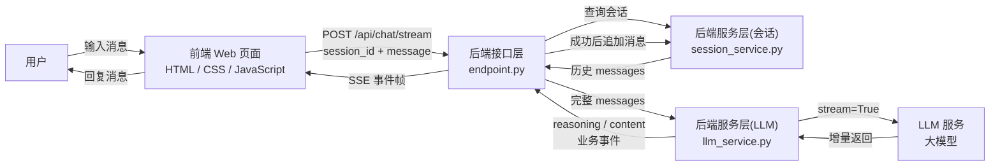

# 第三章：多轮对话

> **导语**：上一章已经打通从浏览器到大模型的 SSE 流式链路，但页面上看似连续的消息仍是彼此独立的单轮问答。本章将引入消息协议、对话历史与会话管理，让模型真正理解上下文。完成本章后，你将能够维护会话上下文，并实现可切换、可连续追问的聊天界面。
>
> **源码版本**：[v0.3](https://github.com/leonlucc/tiny-agent/tree/v0.3)

---

## 1. 让模型记住刚才的对话

先看一段很自然的交流：

```text
用户：请用一句话介绍 Python。
AI：Python 是一种强调可读性、生态丰富的通用编程语言。
用户：它适合初学者吗？
```

第二个问题中的“它”指的是 Python。人类会自然地结合上一轮内容理解这个代词，但大语言模型并不会自动记住应用此前发过的请求。如果第二次调用仍然只发送：

```json
[
  {"role": "user", "content": "它适合初学者吗？"}
]
```

模型看到的只有一句缺少指代对象的话。即使它偶尔猜对，也不是因为拥有了对话记忆。

要让模型可靠地理解连续追问，应用必须在第二次调用时重新提交相关历史：

```json
[
  {"role": "user", "content": "请用一句话介绍 Python。"},
  {"role": "assistant", "content": "Python 是一种强调可读性、生态丰富的通用编程语言。"},
  {"role": "user", "content": "它适合初学者吗？"}
]
```

这揭示了多轮对话的本质：**模型通常没有应用级的持久记忆，所谓“记住上下文”，是应用按顺序保存消息，并在下一次调用时把历史重新发送给模型。**

因此，本章需要同时解决三个问题：

1. 用什么结构表达消息角色和先后顺序？
2. 后端如何把多轮消息归入不同会话，并在请求之间保存？
3. 前端如何切换会话、恢复消息列表，并让新回复继续流式显示？

---

## 2. 整体方案

本章延续了上一章的前后端模块，变化集中在流式链路的前后两端：

- 请求模型之前，后端从会话中取出历史消息，再追加本轮 User 消息。
- 流正常结束之后，后端把完整的 User / Assistant 消息成对写回会话。
- 前端新增会话列表和当前会话状态，可以创建、选择、重命名、删除会话，并恢复消息历史。



一次连续追问的真实运行顺序如下：

1. 页面首次加载会话摘要列表，但默认进入一个尚未持久化的“新会话”草稿。
2. 用户发送第一条消息时，前端调用 `POST /api/sessions` 创建后端会话。
3. 前端调用 `POST /api/chat/stream` 启动聊天，请求体同时携带 `session_id` 和当前 `message`。
4. 后端找到会话，将已有历史转换成模型需要的格式，再在末尾追加当前 User 消息。
5. LLM 服务接收完整 `messages` 列表并发起流式调用。
6. 后端一边把增量编码为 SSE，一边分别累积回答正文和思考内容。
7. 流正常结束且包含有效回复后，后端一次性将本轮 User 与 Assistant 消息添加到会话记录。
8. 前端也把完整的一轮消息加入当前页面状态。
9. 用户切换会话时，前端通过 `GET /api/sessions/{session_id}` 重新取得完整历史并绘制消息列表。

这里存在两类用途不同的历史消息数据：

| 数据 | 保存位置 | 用途 |
| --- | --- | --- |
| 会话与完整消息历史 | 后端 `SessionService` | 组装下一次 LLM 请求，作为上下文的事实来源 |
| 当前会话与页面消息 | 前端 `appState` | 页面立即渲染、切换交互，减少不必要的重复 API 请求 |

前端状态让页面响应更快，后端历史才让模型真正获得上下文。二者不能混为一谈。

---

## 3. 核心概念

### 3.1 Message Protocol（消息协议）：一条消息不只有文本
#### 消息角色
本章把 OpenAI `Chat Completions`（会话补全）接口使用的消息结构称为 Message Protocol。它描述消息的角色、内容与排列顺序，但不是所有模型厂商共同遵循的统一正式协议；具体字段及行为仍以所接入服务的接口说明为准。在本章使用的纯文本消息子集中，每条消息包含：

```json
{
  "role": "user",
  "content": "你好"
}
```

其中，`content` 是消息内容，`role` 表示这段内容由谁提供。本章使用三种角色：

| 角色 | 含义 | 在本项目中的职责 |
| --- | --- | --- |
| `system` | System（系统）消息 | 设定助手身份与全局行为，在创建会话时加入 |
| `user` | User（用户）消息 | 表示用户每一轮的输入 |
| `assistant` | Assistant（助手）消息 | 表示模型已经完成的回复，为后续追问提供上下文 |

角色不是为了给聊天气泡换颜色，而是帮助模型区分“规则”“问题”和“先前回答”。如果只把历史文本拼成一个长字符串，模型仍可能理解，但应用会丢失清晰的发言边界，也难以稳定地维护和裁剪上下文。

> **💡 小贴士：Message 对象不只有一种形态**
>
> 本章使用的是 Chat Completions 消息结构中最小的纯文本子集：`role` 标识消息作者，`content` 保存文本。完整协议还允许某些角色使用由多个内容块组成的 `content`，并通过可选的 `name` 区分同一角色下的不同参与者。Assistant 消息还可以使用 `tool_calls` 请求调用工具，相应结果则通过 Tool 消息返回。不同角色允许的字段并不相同，不能把这些字段视为可以任意组合的通用属性。本章尚未使用这些扩展，因此发送给模型的消息只保留 `role` 和 `content`。Tool 消息将留到后续的工具调用章节展开。

#### System 消息

System 消息是本章首次引入的角色。它用于提供由应用设定、希望在整个会话中持续生效的背景和行为要求，例如：

- 助手是谁，要承担什么职责。
- 回答应使用什么语言、语气或表达风格。
- 应遵循哪些任务边界和输出原则。
- 用户没有重复说明时，默认采用什么上下文。

本章在创建会话时加入：

```json
{
  "role": "system",
  "content": "你是 Tiny Agent，一个简洁、友好的 AI 助手。"
}
```

这条消息不会作为普通聊天气泡展示，却会随历史一起发送给模型。于是，用户连续追问时不必在每一轮重复“请保持简洁、友好”，应用也能为不同会话提供一致的基础行为。

System 消息的必要性不在于“没有它就无法调用模型”——只发送 User 消息同样可以完成一次请求。它真正解决的是**应用要求与用户输入的分层**：稳定的会话级要求由应用放在 System 消息中，本轮具体问题由用户放在 User 消息中。如果二者混在同一段文本里，后续既难以独立维护系统要求，也难以判断哪些内容需要在每轮调用中保留。

在 Tiny Agent 中，每个新会话只有一条位于历史开头的 System 消息。后端裁剪长历史时也会尽量保留它，因为一旦丢失这条消息，后续请求就可能失去最初设定的助手身份和行为前提。

> **💡 小贴士：System 并非刚性约束**
>
> 在 `Chat Completions` 风格的接口中，System 消息通常用于表达比普通 User 输入更稳定的应用级要求；具体角色层级、支持范围和遵循效果仍取决于所使用的模型与兼容服务。无论接口如何定义角色，它都只是提供给模型的指令，不是权限控制或安全隔离机制。模型可能误解指令，恶意输入也可能尝试干扰既定行为。身份认证、数据权限、参数校验等安全规则仍必须由应用代码负责，不能只写进 System 消息。

#### 消息顺序
本章中的消息顺序也具有语义。两轮对话的历史通常是：

```text
system
user
assistant
user
assistant
```

下一次调用前，再把新的 `user` 放到末尾。模型从前往后读取上下文，顺序被打乱就可能错误理解对话关系。

### 3.2 Chat History（对话历史）：有序消息序列

Chat History 是属于某个会话的有序消息序列。本章设计两个数据类表达它：

```python
@dataclass
class Message:
    role: MessageRole
    content: str
    reasoning: str | None = None


@dataclass
class ChatSession:
    session_id: str
    session_name: str
    created_at: str
    messages: list[Message] = field(default_factory=list)
```

可以把二者理解为：

```text
ChatSession
├── session_id
├── session_name
├── created_at
└── messages
    ├── Message(system)
    ├── Message(user)
    ├── Message(assistant)
    └── ...
```

`session_id` 是前后端关联同一段对话的稳定标识；`session_name` 用于侧边栏展示；`created_at` 用于排序；`messages` 则保持实际对话顺序。

`Message` 设计两种序列化方式：

```python
def to_dict(self) -> dict[str, str | None]:
    return {
        "role": self.role,
        "content": self.content,
        "reasoning": self.reasoning,
    }

def to_llm_dict(self) -> dict[str, str]:
    return {"role": self.role, "content": self.content}
```

这是一个很重要的边界：

- `to_dict()` 面向 Tiny Agent 前端，需要把 `reasoning` 一并回复到页面。
- `to_llm_dict()` 面向模型，只发送模型能够消费的 `role` 与 `content`。

同一个领域对象根据下游需要提供不同视图，可以避免把 UI 专用字段耦合到模型接口。

### 3.3 多轮对话不是模型“保存了状态”

假设当前后端历史是：

```python
[
    Message(role="system", content="你是 Tiny Agent……"),
    Message(role="user", content="什么是 SSE？"),
    Message(role="assistant", content="SSE 是一种服务端推送机制……"),
]
```

用户继续问“它和 WebSocket 有什么区别？”时，后端接口层执行：

```python
user_message = Message(role="user", content=message)
messages = [item.to_llm_dict() for item in session.messages]
messages.append(user_message.to_llm_dict())
```

于是本轮模型输入变成：

```python
[
    {"role": "system", "content": "你是 Tiny Agent……"},
    {"role": "user", "content": "什么是 SSE？"},
    {"role": "assistant", "content": "SSE 是一种服务端推送机制……"},
    {"role": "user", "content": "它和 WebSocket 有什么区别？"},
]
```

每轮请求仍然是一次独立的 HTTP 调用。对话连续感来自应用重放消息历史，而不是模型服务替 Tiny Agent 保存了这个会话。

这也意味着历史越长，请求通常越大，占用的上下文窗口和推理成本也越多。因此历史必须有边界，不能无限增长。

### 3.4 流式回答何时写入历史

流式输出不是一次得到完整 Assistant 消息，而是先后收到多个片段。而历史记录需要的是一条完整 Assistant 消息，因此需要后端在向浏览器转发的同时累积片段：

```python
content_parts: list[str] = []
reasoning_parts: list[str] = []

async for event in events:
    if event.get("type") == "content":
        content_parts.append(event.get("chunk", ""))
    elif event.get("type") == "reasoning":
        reasoning_parts.append(event.get("chunk", ""))
    yield ...
```

异步迭代正常结束并且确实收到有效内容，才写入历史记录：

```python
await session_service.add_messages(
    session_id,
    [
        user_message,
        Message(
            role="assistant",
            content="".join(content_parts),
            reasoning="".join(reasoning_parts) or None,
        ),
    ],
)
```

这项设计保证同一轮 User / Assistant 成对出现。如果上游在生成中途异常，页面可以报告错误，但不把残缺回答保存成正式历史。否则下一轮模型可能把半句话当作已经完成的回答，导致上下文越来越混乱。

### 3.5 历史裁剪：保留 System，限制总量

本章引入环境变量 `MAX_MESSAGES_PER_SESSION` 限制单个会话最多保存多少条消息，默认值为 `100`。追加消息后，如果总数超过限制，服务会尽量保留第一条 System 消息，再保留最近的消息：

```python
if len(session.messages) > DEFAULT_MAX_MESSAGES:
    first_message = session.messages[0]
    if first_message.role == "system" and DEFAULT_MAX_MESSAGES > 1:
        recent_start = -(DEFAULT_MAX_MESSAGES - 1)
        session.messages = [
            first_message,
            *session.messages[recent_start:],
        ]
    else:
        session.messages = session.messages[-DEFAULT_MAX_MESSAGES:]
```

这是一种按“消息条数”裁剪的教学版策略。它直观、容易验证，但并不等价于按 Token 数控制模型上下文，也不保证裁剪后一定从完整的一轮开始。更精确的 Token 预算、摘要压缩和轮次边界管理属于后续可扩展方向。

---

## 4. 工程实现

### 4.1 `session_service.py`：对话历史的唯一管理入口

本章新增 `backend/app/services/session_service.py`。它集中管理消息结构、会话结构及内存存储，避免接口层直接操作全局字典。

首先用 Python 的静态类型约束 `Literal` 类型限定合法角色，有助于编辑器和类型检查工具发现赋值错误：

```python
MessageRole = Literal["system", "user", "assistant"]
```
随后，`SessionService` 维护所有会话：

```python
class SessionService:
    def __init__(self) -> None:
        self.sessions: dict[str, ChatSession] = {}
        self._counter = 0
```

创建会话时，会生成 ID、默认名称和创建时间，并立即放入 System 消息：

```python
async def create_session(self) -> ChatSession:
    create_time = datetime.now().strftime(DATE_FORMAT)
    self._counter += 1
    session = ChatSession(
        session_id=f"session_{create_time}_{self._counter}",
        session_name=f"新对话-{self._counter}",
        created_at=create_time,
        messages=[Message(role="system", content=SYSTEM_PROMPT)],
    )
    self.sessions[session.session_id] = session
    return session
```

默认提示词定义为：

```python
SYSTEM_PROMPT = "你是 Tiny Agent，一个简洁、友好的 AI 助手。"
```

System 消息在创建会话时固定进入历史，而不是每次调用时临时拼接。这样从会话详情到模型输入都使用同一份有序数据。

服务还提供以下操作：

| 方法 | 职责 |
| --- | --- |
| `create_session()` | 创建带 System 消息的新会话 |
| `get_session()` | 按 ID 获取会话 |
| `list_sessions()` | 按创建时间倒序返回会话 |
| `rename_session()` | 更新会话名称 |
| `delete_session()` | 删除会话 |
| `add_messages()` | 批量追加同一轮消息并统一裁剪 |

模块末尾创建单例：

```python
session_service = SessionService()
```

因此，同一 Python 进程内的不同请求会访问同一份会话字典。

### 4.2 `endpoint.py`：会话 REST API

本章在原有健康检查和流式聊天接口之外，增加一组会话 REST API：

| 方法与路径 | 请求体 | 返回内容 |
| --- | --- | --- |
| `GET /api/sessions` | 无 | 会话摘要列表，不包含 `messages` |
| `POST /api/sessions` | 无 | 新建会话完整数据，状态码 `201` |
| `GET /api/sessions/{session_id}` | 无 | 指定会话及完整消息 |
| `PUT /api/sessions/{session_id}` | `{"name": "新名称"}` | 重命名后的完整会话 |
| `DELETE /api/sessions/{session_id}` | 无 | `{"success": true}` |

列表接口只返回摘要：

```python
@router.get("/sessions")
async def list_sessions() -> list[dict[str, str]]:
    sessions = await session_service.list_sessions()
    return [session.to_summary_dict() for session in sessions]
```

这是有意的职责划分。侧边栏只需要 ID、名称和创建时间，无需每次加载页面就传输所有会话的完整历史；用户选择某个会话后，再通过详情接口按需加载消息。

不存在的会话统一返回 `404`：

```python
session = await session_service.get_session(session_id)
if session is None:
    raise HTTPException(status_code=404, detail="会话不存在")
```
### 4.3 `chat_stream()`：从当前输入组装完整历史

上一章的请求体只有 `message`。本章新增 `session_id`：

```python
class ChatRequest(BaseModel):
    session_id: str
    message: str
```

请求示例：

```json
{
  "session_id": "session_20260101123000_1",
  "message": "继续解释刚才的例子"
}
```

接口先校验消息和会话，再构造完整模型输入：

```python
@router.post("/chat/stream")
async def chat_stream(request: ChatRequest) -> StreamingResponse:
    message = request.message.strip()
    if not message:
        raise HTTPException(status_code=400, detail="message 不能为空")

    session = await session_service.get_session(request.session_id)
    if session is None:
        raise HTTPException(status_code=404, detail="会话不存在")

    user_message = Message(role="user", content=message)
    messages = [item.to_llm_dict() for item in session.messages]
    messages.append(user_message.to_llm_dict())

    return StreamingResponse(
        _stream_sse(
            stream_chat_events(messages),
            session_id=request.session_id,
            user_message=user_message,
        ),
        media_type="text/event-stream",
        ...
    )
```

注意，当前 User 消息先加入本次模型输入，但还没有写入正式历史。只有 `_stream_sse()` 确认生成成功后，才会把它和 Assistant 回复一起保存。

### 4.4 `llm_service.py`：从单条文本改为完整消息列表

LLM 服务层的变化很小，却是多轮能力真正生效的关键。

上一章接收一个 message 字符串，并在内部构造单条 User 消息；本章改为直接接收完整列表：

```python
async def stream_chat_events(
    messages: list[dict[str, str]],
) -> AsyncIterator[dict[str, str]]:
    response = await _client.chat.completions.create(
        model=_model,
        messages=messages,
        stream=True,
        timeout=30.0,
    )
    ...
```

服务层依旧只负责调用模型并输出 `reasoning` / `content` 业务事件。它不查询会话，也不决定历史是否应该保存。会话编排职责留在接口层，模型协议适配职责留在 LLM 服务层，确保单一职责。

### 4.5 `_stream_sse()`：转发增量并提交完整一轮

`_stream_sse()` 现在同时承担两个紧密相关的职责：

1. 把业务事件编码为 SSE 帧。
2. 收集本轮完整回复，并在流成功结束后提交对话历史。

```python
try:
    async for event in events:
        ...
        yield f"data: {json.dumps(event, ensure_ascii=False)}\n\n"
except Exception:
    logger.exception("LLM 流式调用失败")
    error = {"type": "error", "message": "模型服务暂时不可用，请稍后重试。"}
    yield f"data: {json.dumps(error, ensure_ascii=False)}\n\n"
else:
    has_response = bool(content_parts or reasoning_parts)
    if not has_response:
        error = {"type": "error", "message": "模型未返回有效回复，请稍后重试。"}
        yield f"data: {json.dumps(error, ensure_ascii=False)}\n\n"
    elif session_id is not None and user_message is not None:
        await session_service.add_messages(...)

yield "data: [DONE]\n\n"
```

函数使用 `try / except / else` 区分失败和成功，`else` 只会在 `try` 没有抛出异常时执行。因此：

- 正常且有内容：保存 User / Assistant 消息。
- 正常但空流：发送“模型未返回有效回复”事件，不保存消息。
    - 生成中异常：发送通用错误事件，不保存消息。

这保留了上一章的 SSE 协议，同时为历史写入增加了明确的提交时机。

### 4.6 `api.js`：前端接口与后端会话一一对应

`frontend/js/services/api.js` 新增：

```javascript
const SESSIONS_ENDPOINT = '/api/sessions';
```

`APIClient` 随后封装 `listSessions()`、`createSession()`、`getSession()`、`renameSession()` 和 `deleteSession()`。流式请求也改为携带会话 ID：

```javascript
async chatStream(sessionId, message) {
    const response = await this.request(CHAT_STREAM_ENDPOINT, {
        method: 'POST',
        body: JSON.stringify({ session_id: sessionId, message })
    });
    return response.body.getReader();
}
```

接口模块只处理 HTTP 请求和错误响应，不直接修改页面状态。

### 4.7 `app.js`：集中管理当前会话状态

应用入口的状态从单一的 `isTyping` 扩展为：

```javascript
const appState = {
    sessions: [],
    currentSession: null,
    isTyping: false,
    isSessionLoading: false
};
```

其中：

- `sessions` 保存侧边栏所需的会话集合。
- `currentSession` 保存当前会话及其完整消息。
- `isTyping` 表示模型是否正在流式生成。
- `isSessionLoading` 表示会话是否正在创建、切换或修改。

两个忙碌状态会统一锁定输入区和侧边栏：

```javascript
function syncInteractionState() {
    const isBusy = appState.isTyping || appState.isSessionLoading;
    setSidebarBusy(isBusy);
    setComposerBusy(isBusy);
}
```

这避免用户在生成期间切换或删除会话，使“正在显示的流”“当前会话状态”和“后端写入目标”发生错位。

#### 延迟创建空会话

点击“新建会话”时，前端只进入本地草稿状态：

```javascript
function startNewSession(options = {}) {
    if (!canOperateSession(options.keepLoading)) return;
    appState.currentSession = null;
    renderSessionList();
    updateCurrentTitle();
    renderMessages([]);
    focusComposer();
}
```

直到用户第一次发送消息，`ensureCurrentSession()` 才调用后端：

```javascript
async function ensureCurrentSession() {
    if (appState.currentSession) return appState.currentSession;

    const session = await apiClient.createSession();
    appState.sessions = [session, ...appState.sessions];
    setCurrentSession(session);
    return session;
}
```

这样反复点击“新建会话”不会制造大量没有内容的后端会话。

#### 发送成功后同步前端历史

流式回复完成后，前端把本轮消息加入当前会话：

```javascript
session.messages.push(
    { role: 'user', content },
    {
        role: 'assistant',
        content: streamedContent,
        reasoning: streamedReasoning || null
    }
);
```

后端已经保存了同样的一轮，这里的追加用于保持当前页面状态同步。下一条消息仍然由后端根据自己的对话历史组装模型输入，前端不会把整份历史随请求上传。

### 4.8 `chat-ui.js` 与 `sidebar.js`：消息恢复和会话操作

`chat-ui.js` 新增 `renderMessages()`，在选择会话时清空聊天区并按顺序重绘：

```javascript
function renderMessages(messages = []) {
    dom.chatContainer.replaceChildren();
    const visibleMessages = messages.filter(message => message.role !== 'system');
    ...
}
```

System 消息会参与模型调用，但不会显示为普通聊天气泡。User 与 Assistant 消息则按照历史顺序呈现，Assistant 的 `reasoning` 也可以恢复到思考区域。

新增的 `sidebar.js` 主要负责如下功能，它不持有会话业务状态，而是把操作通过回调交给 `app.js`：

- 绘制会话列表与当前选中态。
- 新建、选择、重命名和删除交互。
- 桌面端折叠与移动端抽屉。

此外，本章还加入 `markdown.js`，使用两个第三方库对大模型返回的 Markdown 格式进行页面渲染， 其中 `marked` 负责将内容解析为 HTML，`DOMPurify` 负责清洗 HTML。这使前端能安全地展示常见的 Markdown 格式，但它是本章的 UI 完善项，不是多轮对话成立的条件。

### 4.9 启动与验证

先切换到本章源码：

```bash
git checkout v0.3
```

安装运行依赖：

```bash
cd backend
.venv/bin/pip install -r requirements.txt
```

如果还没有环境变量文件，可参考 `backend/.env.example` 配置模型服务，然后启动：

```bash
.venv/bin/python -m app.main
```

浏览器访问：

```text
http://127.0.0.1:8000
```

可以用以下步骤验证多轮能力：

1. 输入“请记住项目代号是极简”，等待回复完成。
2. 继续追问“刚才的代号是什么？”。
3. 新建另一个会话，再问“代号是什么？”。
4. 切回第一个会话，确认旧消息重新显示，再继续追问。

预期结果是：第一个会话能结合历史回答“极简”，新会话没有这段上下文，不同会话之间互不共享消息。


本章还新增了前后端单元测试。后端的测试需安装开发依赖并运行：

```bash
.venv/bin/pip install -r requirements-dev.txt
.venv/bin/pytest
```

前端的测试可直接使用 Node.js 运行：

```bash
node --test frontend/tests/*.test.mjs
```

---

## 5. Git Diff 导读

本章的核心变化可以归纳为：

| 变化位置 | 实质变化 | 解决的问题 |
| --- | --- | --- |
| `backend/app/services/`<br>`session_service.py` | 新增 Message、ChatSession 与内存 SessionService | 建立有序、分会话的历史数据结构 |
| `backend/app/api/`<br>`endpoint.py` | 新增会话 CRUD；聊天请求携带 `session_id`；成功后保存完整一轮 | 管理会话生命周期并形成连续上下文 |
| `backend/app/services/`<br>`llm_service.py` | 参数从单条字符串改为完整 `messages` 列表 | 让模型真正收到历史消息 |
| `frontend/js/app.js` | 增加会话集合、当前会话和加载状态 | 协调创建、切换、连续发送与页面同步 |
| `frontend/js/components/`<br>`chat-ui.js` | 支持按历史重绘消息 | 切换会话后恢复聊天内容 |
| `frontend/js/components/`<br>`sidebar.js` | 新增会话列表及增删改选交互 | 让用户管理多段独立对话 |
| `frontend/js/services/`<br>`api.js` | 封装会话 REST API，流式请求增加会话 ID | 对接后端会话能力 |
| `frontend/js/components/`<br>`markdown.js` | 安全解析模型 Markdown | 改善消息展示 |
| `backend/tests/`、<br>`frontend/tests/` | 增加核心回归测试 | 验证历史顺序、失败边界和协议解析 |

建议按真实数据流阅读：

1. 从 `session_service.py` 理解 Message 与 ChatSession。
2. 查看 `endpoint.py` 如何取出历史、追加当前输入，并在成功后保存。
3. 查看 `llm_service.py` 如何原样接收完整消息列表。
4. 查看 `api.js` 和 `app.js` 如何围绕 `session_id` 调度请求。
5. 最后阅读 `chat-ui.js` 与 `sidebar.js` 的界面恢复和操作逻辑。

查看完整差异：

```bash
git diff --stat v0.2..v0.3
```

只关注核心运行代码：

```bash
git diff v0.2..v0.3 -- backend/app frontend
```

---

## 6. 架构思考

### 6.1 为什么历史由后端管理，而不是每次由前端完整上传？

让前端提交全部历史也能实现多轮，但服务端将无法确认消息是否被删改、角色是否被伪造，也难以让多个页面使用一致历史。本章让前端只提交 `session_id` 和当前输入，由后端查找并组装历史，职责更清楚：

- 前端负责告诉后端“在哪个会话中说了什么”。
- 后端负责决定“模型应该看到哪些可信历史”。

这并不意味着前端无需保存任何消息。它仍保留当前会话数据用于快速渲染，只是不把这份 UI 状态当成模型上下文的权威来源。

### 6.2 为什么成功后才保存，而不是发送前先保存 User 消息？

如果先保存 User，模型调用随后失败，历史末尾就会留下一个没有 Assistant 回应的孤立问题。下次重试或追问时，应用需要额外判断这条消息属于失败请求、待重试请求，还是正常的未完成状态。

本章不实现复杂的消息状态机，而是在成功后一次追加 User / Assistant。这个选择非常适合当前教学阶段：历史中只有已经完成的轮次，读取和重放逻辑都保持简单。

代价是失败的用户输入不会成为历史。如果产品需要展示失败消息、支持原地重试，就应为消息增加 `pending`、`completed`、`failed` 等状态，并设计幂等重试策略。

### 6.3 为什么前端生成期间禁止切换会话？

一次流式请求会持续更新某个 Assistant 消息节点，结束时还会修改当前会话的本地历史。如果此时允许切换或删除会话，就必须精确追踪“每条流属于哪个会话、哪个 DOM 节点、是否仍然可见”，并处理多个请求并发完成的顺序。

本章通过忙碌锁把并发问题收窄为“任一时刻只有一个会话操作或一个生成任务”。这不是聊天产品的通用上限，而是为了集中讲清历史管理，不提前引入取消、后台生成和多流调度。

### 6.4 当前内存会话方案有哪些限制？

`SessionService` 的字典让多轮机制一目了然，但它只是当前阶段的最小实现：

- 服务重启后，所有会话都会丢失。
- 多进程或多实例部署时，每个进程拥有不同字典，历史不共享。
- 没有用户身份与权限控制，任何知道会话 ID 的客户端都可访问对应接口。
- 没有数据库事务、并发版本控制和跨设备同步。
- `session_id` 用时间与进程内计数器生成，不是面向分布式系统的全局 ID 方案。

因此，本章所说的“可保留对话历史”，是指同一服务进程存活期间可以跨请求、跨页面操作读取历史，不代表已经实现持久化存储。

### 6.5 按消息条数裁剪历史为什么还不够？

不同消息长度差异很大：一百条“你好”和一百条长代码占用的 Token 完全不同。模型真正受限的是上下文窗口，而不是消息数量。

此外，当前裁剪会保留 System 消息和最近若干条消息，但在某些上限配置下可能从 Assistant 消息开始，破坏完整轮次边界。生产级方案通常还会考虑：

- 根据模型 Token 规则计算预算。
- 优先保留 System 消息和最近的完整轮次。
- 把更早内容压缩成摘要。
- 对工具结果、附件等大消息使用单独策略。

本章先用条数上限建立“历史必须受控”的意识，不提前引入 Tokenizer 和摘要模型。

### 6.6 Message Protocol 与 Prompt（提示词）是什么关系？

Message Protocol 解决“谁说了什么、按什么顺序说”的结构问题；Prompt 则是消息中的具体指令内容。本章已有一个固定 System Prompt，但还没有模板化输入，也没有要求模型返回程序可验证的固定结构。

下一章将在现有多轮消息链路上进一步引入 Prompt Template（提示词模板）、Structured Outputs（结构化输出），让模型回复从面向人阅读的自然语言，演进为程序也能可靠消费的数据。

---

## 7. 本章小结

本章让 Tiny Agent 从“页面上连续显示多次单轮问答”，演进为模型真正拥有上下文的多轮聊天：

- 用 System / User / Assistant 角色表达清晰、有序的 Message Protocol。
- 用 `Message`、`ChatSession` 和 `SessionService` 管理分会话的 Chat History。
- 每次调用前重放历史并追加当前 User 消息，让模型理解连续追问。
- 在流成功后把 User / Assistant 成对写入历史，避免保存残缺回复。
- 通过会话 REST API 支持创建、选择、重命名、删除和恢复对话。
- 前端新增消息历史、会话侧边栏和统一忙碌状态，同时保留 SSE 流式体验。

现在，Tiny Agent 已经能够围绕同一上下文持续交流。但模型输出仍主要是给人阅读的自由文本，程序很难稳定地提取其中字段。

下一章，我们将在多轮对话之上加入提示词模板与结构化输出，让模型不仅“接得上话”，还能够“按约定格式回答”。
