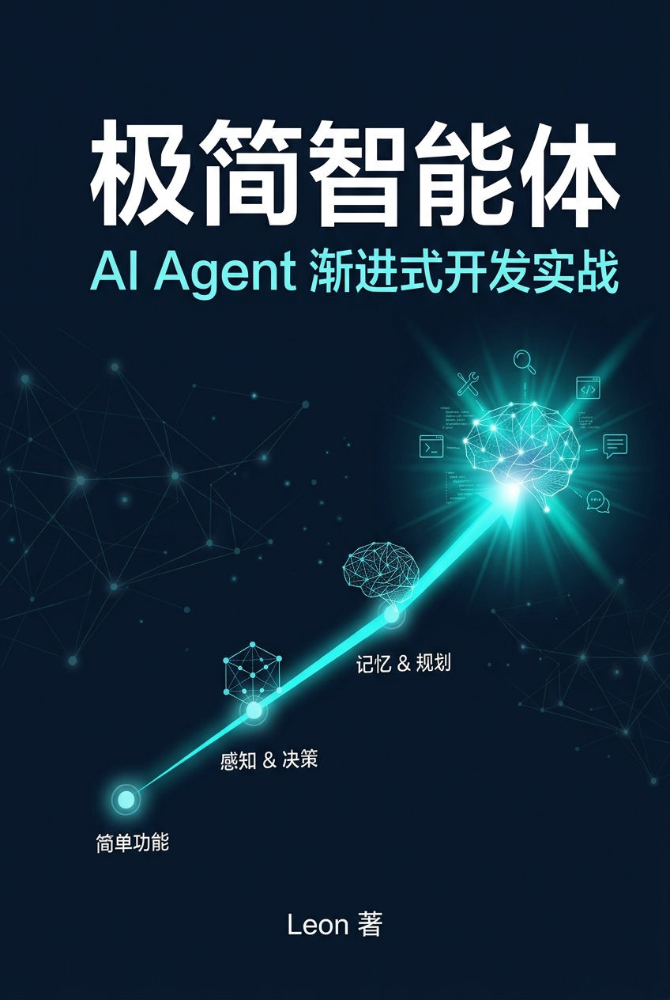

<!-- 封面图容器 -->

    

<!-- 强制 PDF 在此处分页，使后面的正文从第二页开始 -->

# 前言

大模型正在改变软件开发，而 AI Agent 正成为下一代智能应用的核心形态。

然而，大多数教程停留在框架调用和 API 使用层面，很少解释一个 Agent 为什么这样设计、各个模块如何协同工作，以及如何一步步将一个简单的 LLM 对话程序演进为真正具备知识、工具、推理、记忆和协作能力的智能体。

本书采用「渐进式开发」的方式，以 Tiny Agent 为主线，从一次最简单的 LLM 调用开始，依次完成 Chat、Prompt Engineering、RAG、Tool Calling、Agent Loop、Memory、Multi-Agent 等核心能力的构建。每一章对应一个可运行的 Git Tag，每一次迭代都能看到真实的代码演进、架构变化和设计思考。

希望读完这本书后，你不仅能够使用 AI Agent，更能够理解 AI Agent、设计 AI Agent，并亲手构建属于自己的 AI Agent。