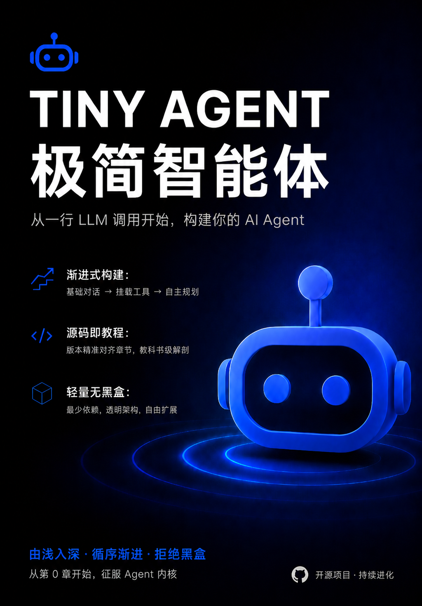

<!-- 封面图容器 -->

    

<!-- 强制 PDF 在此处分页，使后面的正文从第二页开始 -->

# 前言：一次全新的 AI 智能体教程尝试

事情是这样的。我身边有几个 35 岁上下的朋友，这两年都盘算着往 AI 方向转，但聊起来几乎全是焦虑。一方面是 AI 发展实在太快了，今天一个新概念，明天一个新产品，刚觉得自己搞懂了点东西，转眼又冒出一堆听不懂的名词。另一方面，他们也不是没去学过，市面上讲智能体的课程翻了不少，可要么一上来就甩一个臃肿的框架，要么花大量篇幅讲理论，来龙去脉压根没交代清楚。有朋友甚至抱怨：“你讲半天，还不如直接给我一段能跑起来的代码，我自己改两把就明白了。”

这话我越琢磨越觉得有道理。不过真准备动手之前，我也没少在版本路线图上犯纠结。一开始贪多，洋洋洒洒列了二十多个版本，什么功能都想往里塞。回头一看，这种搞法我太熟了——我这个人之前搞事情经常半途而废，堆得越多，烂尾得越快。所以后来我逼着自己做减法，狠心砍到七个版本。心说别求大求全，先把最核心的骨架跑通，看看能坚持到哪。于是就有了Tiny Agent这个开源项目。

它不是什么功能拉满的开发框架，而是一份手把手的教学代码——我把Agent最核心的能力拆成了一个个独立可运行的代码版本，教程每一章与版本对应，你直接切换 `Git Tag` 就能跳到某个版本，看最精简的实现，跑起来随便改。整条路线像搭积木，从最简单的模型调用开始，一层一层往上叠，最后长出一个能自己思考、查资料、调工具的小智能体。

交代一下技术选型。后端用的是 Python 搭配 FastAPI，没什么特别的原因，就是图它轻，几行代码就能起一个服务，而且整个项目不依赖任何重型 Agent 框架，所有逻辑从零手写，你看到的就是全部。前端更干脆——原生 HTML + CSS + JavaScript，故意不用 Vue、React 这些东西，怕的就是前端门槛把想学原理的朋友挡在外面。你只要能看懂页面是怎么拼起来的，就能搞明白数据是怎么在浏览器和服务器之间跑的。

希望读完这个教程后，你不仅能够使用 Agent，更能够理解和设计 Agent，并亲手构建出属于自己的、能解决真实问题的 Agent。

作者：Leon (leonlu.cc@foxmail.com)

> 本书采用 **CC BY-NC-ND 4.0** 许可协议，商业转载请联系作者进行授权，非商业转载请注明出处。
